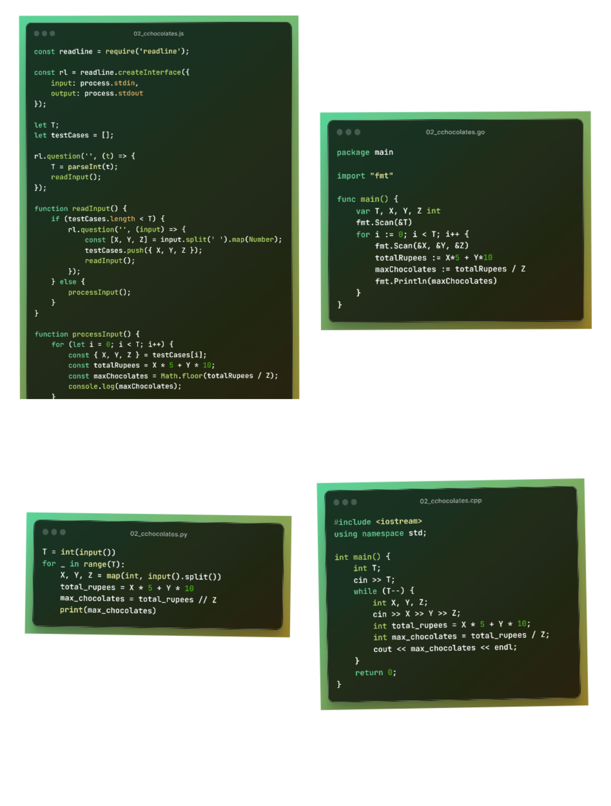

<!--Header-->
<h1 align="center">
   
  ACC 45 days of code  challenge
   
</h1>

<h3 align=center>This is my 45 days of code challenge repository organize by Amity Coding Club that is official club of <a href=https://www.amity.edu/gwalior>Amity University Gwalior</a></h3>

<!--ACC45DAYSOFCODE-2023-->

ACC45DAYSOFCODE-2023
<ol>

<!--Day - 01-->

Day-01
<ol>

This is the content for Day 01.

<h2>Tasks for Day 01:</h2>
<ul>
  <li>Recently, Chef visited his doctor. The doctor advised Chef to drink at least 2000 ml of water each day.

Chef drank X ml of water today. Determine if Chef followed the doctor's advice or not.

<code>Input Format</code>:
- The first line contains a single integer T — the number of test cases. Then the test cases follow.
- The first and only line of each test case contains one integer X — the amount of water Chef drank today.
<code>Output Format</code>:
- For each test case, output YES if Chef followed the doctor's advice of drinking at least 2000 ml of water. Otherwise, output NO.

- You may print each character of the string in uppercase or lowercase (for example, the strings YES, yEs, yes, and yeS will all be treated as identical).

<code>Constraints</code>:
- 1 <= T <= 2000
- 1 <= X <= 4000

<code>Explanation</code>:
Test case 1: Chef followed the doctor's advice since he drank 2999 ml of water which is >=2000 ml.

Test case 2: Chef did not follow the doctor's advice since he drank 
1450 ml of water which is < 2000 ml.

Test case 3: Chef followed the doctor's advice since he drank 2000 ml of water which is >= 2000 ml.</li>
</ul>

For more details, You can find the full problem description on CodeChef's website:
<a href="https://www.codechef.com/practice/PCL05/problems/WATERCONS">Water Consumption Problem Description</a>.

<h2>Solution/Codes</h2>
<li><a href="C++/01_watercons.cpp"><code>C++</code></a></li>
<li><a href="Python/01_watercons.py"><code>Python</code></a></li>
<li><a href="JavaScript/01_watercons.js"><code>JavaScript</code></a></li>
<li><a href="Golang/01_watercons.go"><code>Golang</code></a></li>

Here's an example of using the <code>Python</code> programming language:

<pre>
  <code>
T = int(input())
for _ in range(T):
    X = int(input())
    if X >= 2000:
        print("YES")
    else:
        print("NO")
  </code>
</pre>

</ol>

<!--Day - 02-->

Day-02
<ol>

This is the content for Day 02.

<h2>Tasks for Day 02:</h2>
<ul>
  <li>Chef has X 5 rupee coins and Y 10 rupee coins. Chef goes to a shop to buy chocolates for Chefina where each chocolate costs Z rupees. Find the maximum number of chocolates that Chef can buy for Chefina.</li>
  <li>
    <code>Input Format</code>:
    <ul>
      <li>The first line contains a single integer T — the number of test cases. Then the test cases follow.</li>
      <li>The first and only line of each test case contains three integers X, Y, and Z — the number of 5 rupee coins, the number of 10 rupee coins, and the cost of each chocolate.</li>
    </ul>
  </li>
  <li>
    <code>Output Format</code>:
    <ul>
      <li>For each test case, output the maximum number of chocolates that Chef can buy for Chefina.</li>
    </ul>
  </li>
  <li>
    <code>Constraints</code>:
    <ul>
      <li>1 ≤ T ≤ 100</li>
      <li>1 ≤ X, Y, Z ≤ 1000</li>
    </ul>
  </li>
  <li>
    <code>Sample 1</code>:
    <ul>
      <li><code>Input</code></li>
      <li><code>Output</code></li>
      <li>4</li>
      <li>10 10 10</li>
      <li>3 1 8</li>
      <li>8 1 3</li>
      <li>4 4 1000</li>
      <li><code>Explanation</code>:</li>
      <li>Test case 1: Chef has 10⋅5+10⋅10=150 rupees in total. Since each chocolate costs 10 rupees, Chef can spend all 150 rupees and buy 15 chocolates for Chefina.</li>
      <li>Test case 2: Chef has 3⋅5+1⋅10=25 rupees in total. Since each chocolate costs 8 rupees, Chef can buy a maximum of 3 chocolates for Chefina, leaving him with 1 rupee.</li>
      <li>Test case 3: Chef has 8⋅5+1⋅10=50 rupees in total. Since each chocolate costs 3 rupees, Chef can buy a maximum of 16 chocolates for Chefina, leaving him with 2 rupees.</li>
      <li>Test case 4: Chef has 4⋅5+4⋅10=60 rupees in total. Since each chocolate costs 1000 rupees, Chef can buy no chocolate for Chefina, leaving him with 60 rupees.</li>
    </ul>
  </li>
</ul>

For more details, You can find the full problem description on CodeChef's website:
<a href="https://www.codechef.com/practice/PCBM01/problems/CCHOCOLATES">Chef and Chocolates Problem Description</a>.

<h2>Solution/Codes</h2>
<li><a href="C++/02_cchocolates.cpp"><code>C++</code></a></li>
<li><a href="Python/02_cchocolates.py"><code>Python</code></a></li>
<li><a href="JavaScript/02_cchocolates.js"><code>JavaScript</code></a></li>
<li><a href="Golang/02_cchocolates.go"><code>Golang</code></a></li>

Here's an example of using the <code>Golang</code> programming language:

<pre>
  <code>
package main

import "fmt"

func main() {
    var T, X, Y, Z int
    fmt.Scan(&T)
    for i := 0; i < T; i++ {
        fmt.Scan(&X, &Y, &Z)
        totalRupees := X*5 + Y*10
        maxChocolates := totalRupees / Z
        fmt.Println(maxChocolates)
    }
}
  </code>
</pre>

</ol>

<!--Day - 03-->
<!--Day - 04-->
<!--Day - 05-->
<!--Day - 06-->
<!--Day - 07-->
<!--Day - 08-->
<!--Day - 09-->
<!--Day - 10-->
<!--Day - 11-->
<!--Day - 12-->
<!--Day - 13-->
<!--Day - 14-->
<!--Day - 15-->
<!--Day - 16-->
<!--Day - 17-->
<!--Day - 18-->
<!--Day - 19-->
<!--Day - 20-->
<!--Day - 21-->
<!--Day - 22-->
<!--Day - 23-->
<!--Day - 24-->
<!--Day - 25-->
<!--Day - 26-->
<!--Day - 27-->
<!--Day - 28-->
<!--Day - 29-->
<!--Day - 30-->
<!--Day - 31-->
<!--Day - 32-->
<!--Day - 33-->
<!--Day - 34-->
<!--Day - 35-->
<!--Day - 36-->
<!--Day - 37-->
<!--Day - 38-->
<!--Day - 39-->
<!--Day - 40-->
<!--Day - 41-->
<!--Day - 42-->
<!--Day - 43-->
<!--Day - 44-->
<!--Day - 45-->
</ol>

