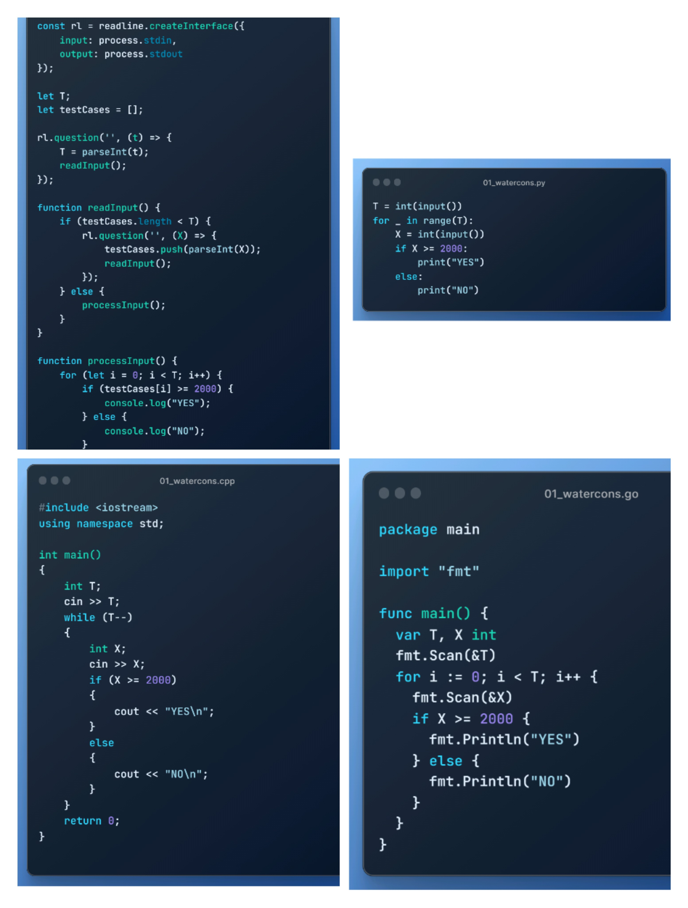
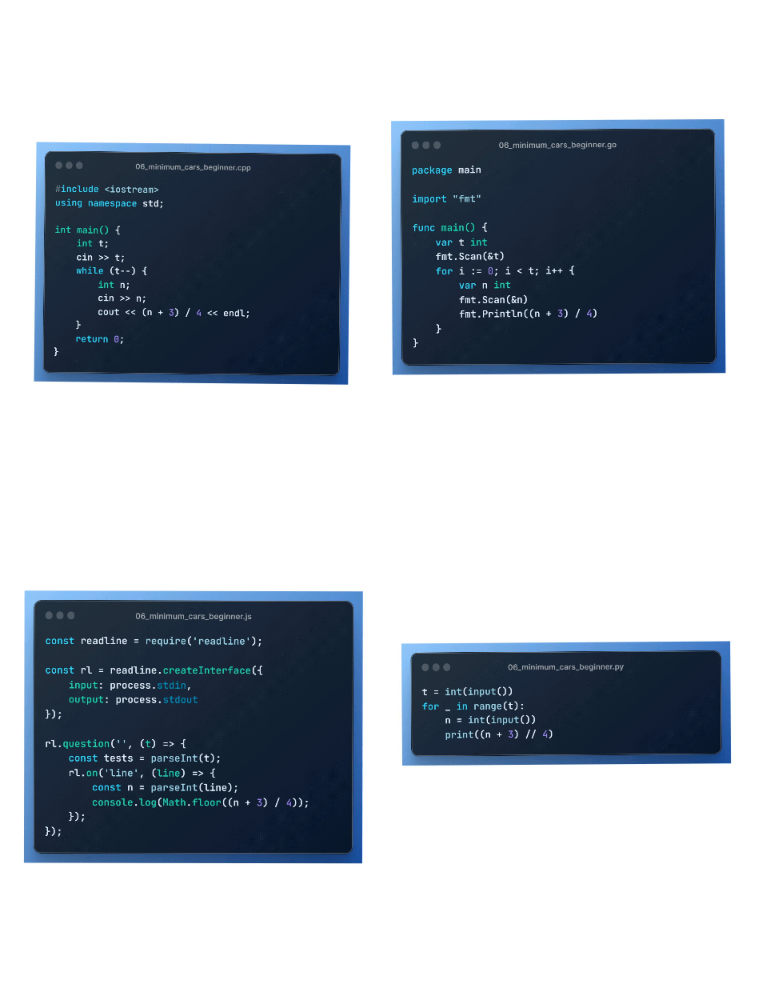

<!--Header-->
<h1 align="center">
   
  ACC 45 days of code  challenge
   
</h1>

<h3 align=center>This is my 45 days of code challenge repository organize by Amity Coding Club that is official club of <a href=https://www.amity.edu/gwalior>Amity University Gwalior</a></h3>

<!--ACC45DAYSOFCODE-2023-->

ACC45DAYSOFCODE-2023
<ol>

<!--Day - 01-->

Day-01
<ol>

This is the content for Day 01.

<h2>Tasks for Day 01:</h2>
<ul>
  <li>Recently, Chef visited his doctor. The doctor advised Chef to drink at least 2000 ml of water each day.

Chef drank X ml of water today. Determine if Chef followed the doctor's advice or not.

<code>Input Format</code>:
- The first line contains a single integer T — the number of test cases. Then the test cases follow.
- The first and only line of each test case contains one integer X — the amount of water Chef drank today.
<code>Output Format</code>:
- For each test case, output YES if Chef followed the doctor's advice of drinking at least 2000 ml of water. Otherwise, output NO.

- You may print each character of the string in uppercase or lowercase (for example, the strings YES, yEs, yes, and yeS will all be treated as identical).

<code>Constraints</code>:
- 1 <= T <= 2000
- 1 <= X <= 4000

<code>Explanation</code>:
Test case 1: Chef followed the doctor's advice since he drank 2999 ml of water which is >=2000 ml.

Test case 2: Chef did not follow the doctor's advice since he drank 
1450 ml of water which is < 2000 ml.

Test case 3: Chef followed the doctor's advice since he drank 2000 ml of water which is >= 2000 ml.</li>
</ul>

For more details, You can find the full problem description on CodeChef's website:
<a href="https://www.codechef.com/practice/PCL05/problems/WATERCONS">Water Consumption Problem Description</a>.

<h2>Solution/Codes</h2>
<li><a href="C++/01_watercons.cpp"><code>C++</code></a></li>
<li><a href="Python/01_watercons.py"><code>Python</code></a></li>
<li><a href="JavaScript/01_watercons.js"><code>JavaScript</code></a></li>
<li><a href="Golang/01_watercons.go"><code>Golang</code></a></li>

Here's an example of using the <code>Python</code> programming language:

<pre>
  <code>
T = int(input())
for _ in range(T):
    X = int(input())
    if X >= 2000:
        print("YES")
    else:
        print("NO")
  </code>
</pre>

</ol>

<!--Day - 02-->

Day-02
<ol>

This is the content for Day 02.

<h2>Tasks for Day 02:</h2>
<ul>
  <li>Chef has X 5 rupee coins and Y 10 rupee coins. Chef goes to a shop to buy chocolates for Chefina where each chocolate costs Z rupees. Find the maximum number of chocolates that Chef can buy for Chefina.</li>
  <li>
    <code>Input Format</code>:
    <ul>
      <li>The first line contains a single integer T — the number of test cases. Then the test cases follow.</li>
      <li>The first and only line of each test case contains three integers X, Y, and Z — the number of 5 rupee coins, the number of 10 rupee coins, and the cost of each chocolate.</li>
    </ul>
  </li>
  <li>
    <code>Output Format</code>:
    <ul>
      <li>For each test case, output the maximum number of chocolates that Chef can buy for Chefina.</li>
    </ul>
  </li>
  <li>
    <code>Constraints</code>:
    <ul>
      <li>1 ≤ T ≤ 100</li>
      <li>1 ≤ X, Y, Z ≤ 1000</li>
    </ul>
  </li>
  <li>
    <code>Sample 1</code>:
    <ul>
      <li><code>Input</code></li>
      <li><code>Output</code></li>
      <li>4</li>
      <li>10 10 10</li>
      <li>3 1 8</li>
      <li>8 1 3</li>
      <li>4 4 1000</li>
      <li><code>Explanation</code>:</li>
      <li>Test case 1: Chef has 10⋅5+10⋅10=150 rupees in total. Since each chocolate costs 10 rupees, Chef can spend all 150 rupees and buy 15 chocolates for Chefina.</li>
      <li>Test case 2: Chef has 3⋅5+1⋅10=25 rupees in total. Since each chocolate costs 8 rupees, Chef can buy a maximum of 3 chocolates for Chefina, leaving him with 1 rupee.</li>
      <li>Test case 3: Chef has 8⋅5+1⋅10=50 rupees in total. Since each chocolate costs 3 rupees, Chef can buy a maximum of 16 chocolates for Chefina, leaving him with 2 rupees.</li>
      <li>Test case 4: Chef has 4⋅5+4⋅10=60 rupees in total. Since each chocolate costs 1000 rupees, Chef can buy no chocolate for Chefina, leaving him with 60 rupees.</li>
    </ul>
  </li>
</ul>

For more details, You can find the full problem description on CodeChef's website:
<a href="https://www.codechef.com/practice/PCBM01/problems/CCHOCOLATES">Chef and Chocolates Problem Description</a>.

<h2>Solution/Codes</h2>
<li><a href="C++/02_cchocolates.cpp"><code>C++</code></a></li>
<li><a href="Python/02_cchocolates.py"><code>Python</code></a></li>
<li><a href="JavaScript/02_cchocolates.js"><code>JavaScript</code></a></li>
<li><a href="Golang/02_cchocolates.go"><code>Golang</code></a></li>

Here's an example of using the <code>Golang</code> programming language:

<pre>
  <code>
package main

import "fmt"

func main() {
    var T, X, Y, Z int
    fmt.Scan(&T)
    for i := 0; i < T; i++ {
        fmt.Scan(&X, &Y, &Z)
        totalRupees := X*5 + Y*10
        maxChocolates := totalRupees / Z
        fmt.Println(maxChocolates)
    }
}
  </code>
</pre>

</ol>

<!--Day - 03-->

Day-03
<ol>

This is the content for Day 03.

<h2>Tasks for Day 03:</h2>
<ul>
  <li>
    <strong>Problem</strong>
    
Chef's coding class is very famous in Chefland. This year X students joined his class, and each student will require one chair to sit on. Chef already has Y chairs in his class. Determine the minimum number of new chairs Chef must buy so that every student is able to get one chair to sit on.

  </li>
  <li>
    <strong>Input Format</strong>
    
The first line contains a single integer T — the number of test cases. Then the test cases follow.

    
The first and only line of each test case contains two integers X and Y — the number of students in the class and the number of chairs Chef already has.

  </li>
  <li>
    <strong>Output Format</strong>
    
For each test case, output the minimum number of extra chairs Chef must buy so that every student gets one chair.

  </li>
  <li>
    <strong>Constraints</strong>
    
1 ≤ T ≤ 1000

    
0 ≤ X, Y ≤ 100

  </li>
  <li>
    <strong>Sample 1:</strong>
    <ul>
      <li>
        <strong>Input</strong>
        
4

        
20 14

        
41 41

        
35 0

        
50 100

      </li>
      <li>
        <strong>Output</strong>
        
6

        
0

        
35

        
0

      </li>
      <li>
        <strong>Explanation</strong>
        
Test case 1: There are 20 students in the class, and Chef has 14 chairs already. Therefore Chef must buy 6 more chairs.

        
Test case 2: There are 41 students in the class, and Chef already has exactly 41 chairs. Therefore Chef does not need to buy any more chairs.

        
Test case 3: There are 35 students in the class, and Chef has no chairs initially. Therefore Chef must buy 35 chairs.

      </li>
    </ul>
  </li>
</ul>

For more details, You can find the full problem description on CodeChef's website:
<a href="https://www.codechef.com/problems/CHAIRS_">Chairs Requirement Problem Description</a>.

<h2>Solution/Codes</h2>
<li><a href="C++/03_chair_distribution.cpp"><code>C++</code></a></li>
<li><a href="Python/03_chair_distribution.py"><code>Python</code></a></li>
<li><a href="JavaScript/03_chair_distribution.js"><code>JavaScript</code></a></li>
<li><a href="Golang/03_chair_distribution.go"><code>Golang</code></a></li>

Here's an example of using the <code>JavaScript</code> programming language:

<pre>
  <code>
const readline = require('readline');

const rl = readline.createInterface({
    input: process.stdin,
    output: process.stdout
});

let T;
let testCases = [];

rl.question('', (t) => {
    T = parseInt(t);
    readInput();
});

function readInput() {
    if (testCases.length < T) {
        rl.question('', (input) => {
            const [X, Y] = input.split(' ').map(Number);
            testCases.push({ X, Y });
            readInput();
        });
    } else {
        processInput();
    }
}

function processInput() {
    for (let i = 0; i < T; i++) {
        const { X, Y } = testCases[i];
        const extraChairs = Math.max(0, X - Y);
        console.log(extraChairs);
    }
    rl.close();
}
  </code>
</pre>

</ol>

<!--Day - 04-->
<!--Beginner-->

Day-04 - Beginner
<ol>

Today's Beginner problem:

<ul>
  <li>Chef has started working at the candy store. The store has 100 chocolates in total.</li>
  <li>Chef’s daily goal is to sell X chocolates. For each chocolate sold, he will get 1 rupee. However, if Chef exceeds his daily goal, he gets 2 rupees per chocolate for each extra chocolate.</li>
  <li>If Chef sells Y chocolates in a day, find the total amount he made.</li>
  <li>
    <code>Input Format</code>:
    <ul>
      <li>The first line of input will contain a single integer T, denoting the number of test cases.</li>
      <li>Each test case consists of two space-separated integers X and Y — the daily goal of Chef and the number of chocolates he actually sells.</li>
    </ul>
  </li>
  <li>
    <code>Output Format</code>:
    <ul>
      <li>For each test case, output on a new line the total amount Chef made in a day.</li>
    </ul>
  </li>
  <li>
    <code>Constraints</code>:
    <ul>
      <li>1 ≤ T ≤ 100</li>
      <li>1 ≤ X, Y ≤ 10</li>
    </ul>
  </li>
  <li>
    <code>Sample 1:</code>
    <ul>
      <li>
        <code>Input</code>
        
4

        
3 1

        
5 5

        
4 7

        
2 3

      </li>
      <li>
        <code>Output</code>
        
1

        
5

        
10

        
4

      </li>
      <li>
        <code>Explanation</code>:
        
Test case 1: Chef's daily goal was 3. Since he sold only 1 chocolate, he'll get only 1 rupee.

        
Test case 2: Chef's daily goal was 5. Since he sold 5 chocolates, he'll get 5 rupees.

        
Test case 3: Chef's daily goal was 4. Since he sold 7 chocolates, he'll get 4 rupees for the 4 chocolates as his daily goal and 2 rupees per chocolate for the extra 3 chocolates. The total amount he gets is 4 + 3 * 2 = 10.

        
Test case 4: Chef's daily goal was 2. Since he sold 3 chocolates, he'll get 2 rupees for the 2 chocolates as his daily goal and 2 rupees per chocolate for the extra 1 chocolate. The total amount he gets is 2 + 1 * 2 = 4.

      </li>
    </ul>
  </li>
</ul>

For more details, You can find the full problem description on CodeChef's website:
<a href="https://www.codechef.com/practice/PCBM01/problems/CANDYSTORE">Candy Store Problem Description</a>.

<h2>Solution/Codes</h2>
<li><a href="C++/04_candy_store_beginner.cpp"><code>C++</code></a></li>
<li><a href="Python/04_candy_store_beginner.py"><code>Python</code></a></li>
<li><a href="JavaScript/04_candy_store_beginner.js"><code>JavaScript</code></a></li>
<li><a href="Golang/04_candy_store_beginner.go"><code>Golang</code></a></li>

Here's an example of using the <code>C++</code> programming language:

<pre>
  <code>
#include <iostream>
using namespace std;

int main() {
    int t;
    cin >> t;
    while (t--) {
        int x, y;
        cin >> x >> y;
        if (x >= y) {
            cout << y;
        } else {
            cout << x + 2 * (y - x);
        }
        cout << endl;
    }
    return 0;
}
  </code>
</pre>

</ol>

<!--Intermediate-->

Day-04 - Intermediate
<ol>

Today's Intermediate problem:

<ul>
  <li>Task here!!</li>
</ul>

For more details, You can find the full problem description on CodeChef's website:
<a href="https://www.codechef.com/START101D/problems/SMARTER">Work Smarter, Not Harder Problem Description</a>.

<h2>Solution/Codes</h2>
<li><a href="C++/04_MindfulRace_Intermediate.cpp"><code>C++</code></a></li>
<li><a href="Python/04_MindfulRace_Intermediate.py"><code>Python</code></a></li>
<li><a href="JavaScript/04_MindfulRace_Intermediate.js"><code>❌ JavaScript</code></a></li>
<li><a href="Golang/04_MindfulRace_Intermediate.go"><code>❌ Golang</code></a></li>

Here's an example of using the <code>C++</code> programming language:

<pre>
  <code>
#include <iostream>
#include <math.h>
#include <iomanip>
using namespace std;

int main() {
    int t;
    float L, v1, v2;
    cin >> t;
    while (t--) {
        cin >> L >> v1 >> v2;
        setprecision(3);
        int t1 = ceil(L / v1);
        int t2 = ceil(L / v2);
        if (t1 > t2) {
            if (t1 == t2 + 1)
                cout << "0" << endl;
            else
                cout << t1 - t2 - 1 << endl;
        } else if (t1 == t2)
            cout << "-1" << endl;
    }
    return 0;
}
  </code>
</pre>

</ol>

<!--Day - 05-->
<!--Day - 05-->
<!--Beginner-->

Day-05 - Beginner
<ol>

Today's Beginner problem:

<ul>
  <li>
    <strong>Problem:</strong> Chef's phone shows a Battery Low notification if the battery level is 15% or less.
  </li>
  <li>
    <strong>Input Format:</strong>
    <ul>
      <li>The first line will contain T, the number of test cases.</li>
      <li>Each test case contains a single line of input, an integer X, denoting the battery level of the phone.</li>
    </ul>
  </li>
  <li>
    <strong>Output Format:</strong>
    <ul>
      <li>For each test case, output in a single line "Yes" if the battery level is 15% or below. Otherwise, print "No".</li>
    </ul>
  </li>
  <li>
    <strong>Constraints:</strong>
    <ul>
      <li>1 ≤ T ≤ 100</li>
      <li>1 ≤ X ≤ 100</li>
    </ul>
  </li>
  <li>
    <strong>Sample Input:</strong>
    <pre>
      3
      15
      3
      65
    </pre>
  </li>
  <li>
    <strong>Sample Output:</strong>
    <pre>
      Yes
      Yes
      No
    </pre>
  </li>
  <li>
    <strong>Explanation:</strong>
    <ul>
      <li>Test Case 1: The battery level is 15%. Thus, it would show a battery low notification.</li>
      <li>Test Case 2: The battery level is 3%, which is less than 15%. Thus, it would show a battery low notification.</li>
      <li>Test Case 3: The battery level is 65%, which is greater than 15%. Thus, it would not show a battery low notification.</li>
    </ul>
  </li>
</ul>

For more details, You can find the full problem description on CodeChef's website:
<a href="https://www.codechef.com/problems/BATTERYLOW">Battery Low Problem Description</a>.

<h2>Solution/Codes</h2>
<li><a href="C++/05_battery_low_beginner.cpp"><code>C++</code></a></li>
<li><a href="Python/05_battery_low_beginner.py"><code>Python</code></a></li>
<li><a href="JavaScript/05_battery_low_beginner.js"><code>JavaScript</code></a></li>
<li><a href="Golang/05_battery_low_beginner.go"><code>Golang</code></a></li>

Here's an example of using the <code>Python</code> programming language:

<pre>
  <code>
t = int(input())
for _ in range(t):
    x = int(input())
    if x <= 15:
        print("Yes")
    else:
        print("No")
  </code>
</pre>

</ol>

<!--Intermediate-->

Day-05 - Intermediate
<ol>

Today's Intermediate problem:

<ul>
  <li>
    <strong>Problem:</strong> You and your friend are playing a game with hoops. There are N hoops (where N is odd) in a row. You jump into hoop 1, and your friend jumps into hoop N. Then you jump into hoop 2, and after that, your friend jumps into hoop (N-1), and so on. The process ends when someone cannot make the next jump because the hoop is occupied by the other person. Find the last hoop that will be jumped into.
  </li>
  <li>
    <strong>Input Format:</strong>
    <ul>
      <li>The first line contains an integer T, the number of test cases. Then the test cases follow.</li>
      <li>Each test case contains a single line of input, a single integer N.</li>
    </ul>
  </li>
  <li>
    <strong>Output Format:</strong>
    <ul>
      <li>For each testcase, output in a single line the answer to the problem.</li>
    </ul>
  </li>
  <li>
    <strong>Constraints:</strong>
    <ul>
      <li>1 ≤ T ≤ 10^5</li>
      <li>1 ≤ N < 2 * 10^5 (N is odd)</li>
    </ul>
  </li>
  <li>
    <strong>Sample Input:</strong>
    <pre>
      2
      1
      3
    </pre>
  </li>
  <li>
    <strong>Sample Output:</strong>
    <pre>
      1
      2
    </pre>
  </li>
  <li>
    <strong>Explanation:</strong>
    <ul>
      <li>Test Case 1: Since there is only 1 hoop, that's the only one to be jumped into.</li>
      <li>Test Case 2: The first player jumps into hoop 1. The second player jumps into hoop 3 and finally the first player jumps into hoop 2. Then the second player cannot make another jump, so the process stops.</li>
    </ul>
  </li>
</ul>

For more details, You can find the full problem description on CodeChef's website:
<a href="https://www.codechef.com/practice/LP1TO201/problems/HOOPS">Hoop Jump Problem Description</a>.

<h2>Solution/Codes</h2>
<li><a href="C++/05_jumping_hoops_Intermediate.cpp"><code>C++</code></a></li>
<li><a href="Python/05_jumping_hoops_Intermediate.py"><code>Python</code></a></li>
<li><a href="JavaScript/05_jumping_hoops_Intermediate.js"><code>❌ JavaScript</code></a></li>
<li><a href="Golang/05_jumping_hoops_Intermediate.go"><code>Golang</code></a></li>

Here's an example of using the <code>Python</code> programming language:

<pre>
  <code>
  t = int(input())
for _ in range(t):
    n = int(input())
    print((n + 1) // 2)
  </code>
</pre>

</ol>

<!--Day - 06-->
<!--Beginner-->

Day-06 - Beginner
<ol>

Today's Beginner problem:

<ul>
  <li>
    <strong>Problem Name:</strong> Minimum Cars for Friends
  </li>
  <li>
    <strong>Description:</strong> A single car can accommodate at most 4 people. N friends want to go to a restaurant for a party. Find the minimum number of cars required to accommodate all the friends.
  </li>
  <li>
    <strong>Input Format:</strong>
    <ul>
      <li>The first line contains a single integer T, the number of test cases. Then the test cases follow.</li>
      <li>Each test case contains a single line of input, a single integer N - denoting the number of friends.</li>
    </ul>
  </li>
  <li>
    <strong>Output Format:</strong>
    <ul>
      <li>For each test case, output the minimum number of cars required to accommodate all the friends.</li>
    </ul>
  </li>
  <li>
    <strong>Constraints:</strong>
    <ul>
      <li>1 ≤ T ≤ 1000</li>
      <li>2 ≤ N ≤ 1000</li>
    </ul>
  </li>
  <li>
    <strong>Sample Input:</strong>
    <pre>
      4
      4
      2
      7
      98
    </pre>
  </li>
  <li>
    <strong>Sample Output:</strong>
    <pre>
      1
      1
      2
      25
    </pre>
  </li>
  <li>
    <strong>Explanation:</strong>
    <ul>
      <li>Test Case 1: There are only 4 friends and a single car can accommodate 4 people. Thus, only 1 car is required.</li>
      <li>Test Case 2: There are only 2 friends and a single car can accommodate 4 people. Thus, only 1 car is required.</li>
      <li>Test Case 3: There are 7 friends and 2 cars can accommodate 8 people. Thus, 2 cars are required.</li>
    </ul>
  </li>
</ul>

For more details, You can find the full problem description on CodeChef's website:
<a href="https://www.codechef.com/problems/MINCARS">Minimum Cars required Problem Description</a>.

<h2>Solution/Codes</h2>
<li><a href="C++/06_minimum_cars_beginner.cpp"><code>C++</code></a></li>
<li><a href="Python/06_minimum_cars_beginner.py"><code>Python</code></a></li>
<li><a href="JavaScript/06_minimum_cars_beginner.js"><code>JavaScript</code></a></li>
<li><a href="Golang/06_minimum_cars_beginner.go"><code>Golang</code></a></li>

Here's an example of using the <code>Golang</code> programming language:

<pre>
  <code>
package main

import "fmt"

func main() {
    var t int
    fmt.Scan(&t)
    for i := 0; i < t; i++ {
        var n int
        fmt.Scan(&n)
        fmt.Println((n + 3) / 4)
    }
}
  </code>
</pre>

</ol>

<!--Intermediate-->

Day-06 - Intermediate
<ol>

Today's Intermediate problem:

<ul>
  <li>
    <strong>Problem Name:</strong> Rearrange Digits for Multiple of 5
  </li>
  <li>
    <strong>Description:</strong> Given a positive integer N, MoEngage wants you to determine if it is possible to rearrange the digits of N (in decimal representation) and obtain a multiple of 5. For example, when N = 108, we can rearrange its digits to construct 180 = 36 * 5, which is a multiple of 5.
  </li>
  <li>
    <strong>Input Format:</strong>
    <ul>
      <li>The first line contains an integer T, the number of test cases. The description of the T test cases follows.</li>
      <li>Each test case consists of two lines:
        <ul>
          <li>The first line contains a single integer D, the number of digits in N.</li>
          <li>The second line consists of a string of length D, the number N (in decimal representation). It is guaranteed that the string does not contain leading zeroes and consists only of the characters 0, 1, ..., 9.</li>
        </ul>
      </li>
    </ul>
  </li>
  <li>
    <strong>Output Format:</strong>
    <ul>
      <li>For each test case, print "Yes" if it is possible to rearrange the digits of N so that it becomes a multiple of 5. Otherwise, print "No".</li>
    </ul>
  </li>
  <li>
    <strong>Constraints:</strong>
    <ul>
      <li>1 ≤ T ≤ 1000</li>
      <li>1 ≤ D ≤ 1000</li>
      <li>1 ≤ N < 10^1000</li>
      <li>Sum of D over all test cases ≤ 1000</li>
    </ul>
  </li>
  <li>
    <strong>Sample Input:</strong>
    <pre>
      3
      3
      115
      3
      103
      3
      119
    </pre>
  </li>
  <li>
    <strong>Sample Output:</strong>
    <pre>
      Yes
      Yes
      No
    </pre>
  </li>
  <li>
    <strong>Explanation:</strong>
    <ul>
      <li>Test Case 1: The given number is already divisible by 5, therefore the answer is "Yes".</li>
      <li>Test Case 2: We can obtain 310 = 62 * 5 by rearranging the digits of 103, so the answer is "Yes".</li>
      <li>Test Case 3: The only numbers that can be obtained by rearranging the digits of 119 are {119, 191, 911}. None of these numbers are multiples of 5, so the answer is "No".</li>
    </ul>
  </li>
</ul>

For more details, You can find the full problem description on CodeChef's website:
<a href="https://www.codechef.com/problems/DIGARR">Rearranging digits to get a multiple of 5 Problem Description</a>.

<h2>Solution/Codes</h2>
<li><a href="C++/06_rearrange_digits_Intermediate.cpp"><code>❌ C++</code></a></li>
<li><a href="Python/06_rearrange_digits_Intermediate.py"><code>❌ Python</code></a></li>
<li><a href="JavaScript/06_rearrange_digits_Intermediate.js"><code>❌ JavaScript</code></a></li>
<li><a href="Golang/06_rearrange_digits_Intermediate.go"><code>❌ Golang</code></a></li>

Here's an example of using the <code>JavaScript</code> programming language:

<pre>
  <code>
    //❌
  </code>
</pre>

</ol>

<!--Day - 07-->
<!--Beginner-->

Day-07 - Beginner
<ol>

Today's Beginner problem:

<ul>
  <li>
    <strong>Problem:</strong> Chef categorises an Instagram account as spam if the following count of the account is more than 10 times the count of followers. Given the following and follower count of an account as X and Y respectively, find whether it is a spam account.
  </li>
  <li>
    <strong>Input Format:</strong>
    <ul>
      <li>The first line of input will contain a single integer T, denoting the number of test cases.</li>
      <li>Each test case consists of two space-separated integers X and Y — the following and follower count of an account, respectively.</li>
    </ul>
  </li>
  <li>
    <strong>Output Format:</strong>
    <ul>
      <li>For each test case, output on a new line, YES, if the account is spam and NO otherwise.</li>
    </ul>
  </li>
  <li>
    <strong>Constraints:</strong>
    <ul>
      <li>1 ≤ T ≤ 100</li>
      <li>1 ≤ X, Y ≤ 100</li>
    </ul>
  </li>
  <li>
    <strong>Sample Input:</strong>
    <pre>
      4
      1 10
      10 1
      11 1
      97 7
    </pre>
  </li>
  <li>
    <strong>Sample Output:</strong>
    <pre>
      NO
      NO
      YES
      YES
    </pre>
  </li>
  <li>
    <strong>Explanation:</strong>
    <ul>
      <li>Test Case 1: The following count is 1 while the follower count is 10. Since the following count is not more than 10 times the follower count, the account is not spam.</li>
      <li>Test Case 2: The following count is 10 while the follower count is 1. Since the following count is not more than 10 times the follower count, the account is not spam.</li>
      <li>Test Case 3: The following count is 11 while the follower count is 1. Since the following count is more than 10 times the follower count, the account is spam.</li>
      <li>Test Case 4: The following count is 97 while the follower count is 7. Since the following count is more than 10 times the follower count, the account is spam.</li>
    </ul>
  </li>
</ul>

For more details, You can find the full problem description on CodeChef's website:
<a href="https://www.codechef.com/problems/INSTAGRAM">Instagram Problem Description</a>.

<h2>Solution/Codes</h2>
<li><a href="C++/07_spam_account_beginner.cpp"><code>C++</code></a></li>
<li><a href="Python/07_spam_account_beginner.py"><code>❌ Python</code></a></li>
<li><a href="JavaScript/07_spam_account_beginner.js"><code>❌ JavaScript</code></a></li>
<li><a href="Golang/07_spam_account_beginner.go"><code>❌ Golang</code></a></li>

Here's an example of using the <code>C++</code> programming language:

<pre>
  <code>
#include <iostream>
using namespace std;

int main() {
    int t;
    cin >> t;
    while (t--) {
        int x, y;
        cin >> x >> y;
        cout << ((x > 10 * y) ? "YES" : "NO") << endl;
    }
    return 0;
}
  </code>
</pre>

</ol>

<!--Intermediate-->

Day-07 - Intermediate
<ol>

Today's Intermediate problem:

<ul>
  <li>
    <strong>Problem:</strong> The mayor of your city wants to throw a party and gather the favor of his people in different regions of the city. There are 3 distinct regions in the city, namely A, B, C, comprising of PA, PB, and PC number of people, respectively. However, people from region B are in conflict with people from regions A and C. Help the mayor invite the maximum number of people to the party without any conflicts.
  </li>
  <li>
    <strong>Input Format:</strong>
    <ul>
      <li>The first line contains a single integer T, the number of test cases. Then the test cases follow.</li>
      <li>For each test case, the first line contains three integers PA, PB, and PC, representing the number of people living in regions A, B, and C, respectively.</li>
    </ul>
  </li>
  <li>
    <strong>Output Format:</strong>
    <ul>
      <li>For each test case, output the maximum number of people that can be invited to the party without any conflicts.</li>
    </ul>
  </li>
  <li>
    <strong>Constraints:</strong>
    <ul>
      <li>1 ≤ T ≤ 1000</li>
      <li>1 ≤ PA, PB, PC ≤ 1000</li>
    </ul>
  </li>
  <li>
    <strong>Sample Input:</strong>
    <pre>
      3
      2 3 4
      1 5 2
      8 8 8
    </pre>
  </li>
  <li>
    <strong>Sample Output:</strong>
    <pre>
      6
      5
      16
    </pre>
  </li>
  <li>
    <strong>Explanation:</strong>
    <ul>
      <li>Test Case 1: The mayor can invite all the people from regions A and C. So the maximum number of people invited is 6.</li>
      <li>Test Case 2: The mayor can invite all the people from region B. So the maximum number of people invited is 5.</li>
      <li>Test Case 3: The mayor can invite all the people from any one region without conflicts, so the maximum number of people invited is 16.</li>
    </ul>
  </li>
</ul>

For more details, You can find the full problem description on CodeChef's website:
<a href="https://www.codechef.com/problems/MAYOR_PARTY">Peaceful Party Problem Description</a>.

<h2>Solution/Codes</h2>
<li><a href="C++/07_mayors_party_Intermediate.cpp"><code>❌ C++</code></a></li>
<li><a href="Python/07_mayors_party_Intermediate.py"><code>❌ Python</code></a></li>
<li><a href="JavaScript/07_mayors_party_Intermediate.js"><code>❌ JavaScript</code></a></li>
<li><a href="Golang/07_mayors_party_Intermediate.go"><code>❌ Golang</code></a></li>

Here's an example of using the <code>Python</code> programming language:

<pre>
  <code>
    //❌ 
  </code>
</pre>

</ol>

<!--Day - 08-->
<!--Beginner-->

Day-08 - Beginner
<ol>

Today's Beginner problem:

<ul>
  <li>
    <strong>Problem:</strong> A geyser has a capacity of X litres of water, and a bucket has a capacity of Y litres of water. One person requires exactly 2 buckets of water to take a bath. Find the maximum number of people that can take a bath using water from one completely filled geyser.
  </li>
  <li>
    <strong>Input Format:</strong>
    <ul>
      <li>The first line contains an integer T, the number of test cases. Then the test cases follow.</li>
      <li>Each test case consists of a single line of input with two integers X and Y, representing the capacity of the geyser and the bucket, respectively.</li>
    </ul>
  </li>
  <li>
    <strong>Output Format:</strong>
    <ul>
      <li>For each test case, output the maximum number of people that can take a bath.</li>
    </ul>
  </li>
  <li>
    <strong>Constraints:</strong>
    <ul>
      <li>1 ≤ T ≤ 1000</li>
      <li>1 ≤ X, Y ≤ 100</li>
    </ul>
  </li>
  <li>
    <strong>Sample Input:</strong>
    <pre>
      4
      10 6
      25 1
      100 10
      30 40
    </pre>
  </li>
  <li>
    <strong>Sample Output:</strong>
    <pre>
      0
      12
      5
      0
    </pre>
  </li>
  <li>
    <strong>Explanation:</strong>
    <ul>
      <li>Test Case 1: One bucket has a capacity of 6 litres. This means that one person requires 2 * 6 = 12 litres of water to take a bath. Since this is less than the total water present in the geyser, 0 people can take a bath.</li>
      <li>Test Case 2: One bucket has a capacity of 1 litre. This means that one person requires 2 * 1 = 2 litres of water to take a bath. The total amount of water present in the geyser is 25 litres. Thus, 12 people can take a bath. Note that 1 litre of water would remain unused in the geyser.</li>
      <li>Test Case 3: One bucket has a capacity of 10 litres. This means that one person requires 2 * 10 = 20 litres of water to take a bath. The total amount of water present in the geyser is 100 litres. Thus, 5 people can take a bath. Note that 0 litres of water would remain unused in the geyser after this.</li>
    </ul>
  </li>
</ul>

For more details, You can find the full problem description on CodeChef's website:
<a href="https://www.codechef.com/problems/BATH">Bath in Winters Problem Description</a>.

<h2>Solution/Codes</h2>
<li><a href="C++/08_geyser_bath_capacity_beginner.cpp"><code>C++</code></a></li>
<li><a href="Python/08_geyser_bath_capacity_beginner.py"><code>Python</code></a></li>
<li><a href="JavaScript/08_geyser_bath_capacity_beginner.js"><code>❌ JavaScript</code></a></li>
<li><a href="Golang/08_geyser_bath_capacity_beginner.go"><code>Golang</code></a></li>

Here's an example of using the <code>Golang</code> programming language:

<pre>
  <code>
package main

import "fmt"

func main() {
    var T int
    fmt.Scan(&T)
    for i := 0; i < T; i++ {
        var X, Y int
        fmt.Scan(&X, &Y)
        maxPeople := X / (2 * Y)
        fmt.Println(maxPeople)
    }
}
  </code>
</pre>

</ol>

<!--Intermediate-->

Day-08 - Intermediate
<ol>

Today's Intermediate problem:

<ul>
  <li>
    <strong>Problem:</strong> Chef decided to buy a new tablet. His budget is <i>B</i>, so he cannot buy a tablet whose price is greater than <i>B</i>. Other than that, he only has one criterion — the area of the tablet's screen should be as large as possible. Of course, the screen of a tablet is always a rectangle.
  </li>
  <li>
    <strong>Input:</strong>
    <ul>
      <li>The first line of the input contains a single integer <i>T</i> denoting the number of test cases. The description of <i>T</i> test cases follows.</li>
      <li>The first line of each test case contains two space-separated integers <i>N</i> and <i>B</i>.</li>
      <li><i>N</i> lines follow. For each <i>i</i> (1 ≤ <i>i</i> ≤ <i>N</i>), the <i>i</i>-th of these lines contains three space-separated integers <i>Wi</i>, <i>Hi</i>, and <i>Pi</i>.</li>
    </ul>
  </li>
  <li>
    <strong>Output:</strong>
    <ul>
      <li>For each test case, print a single line. If Chef cannot buy any tablet, it should contain the string "no tablet" (without quotes). Otherwise, it should contain a single integer — the maximum area of the screen of a tablet Chef can buy.</li>
    </ul>
  </li>
  <li>
    <strong>Constraints:</strong>
    <ul>
      <li>1 ≤ <i>T</i> ≤ 100</li>
      <li>1 ≤ <i>N</i> ≤ 100</li>
      <li>1 ≤ <i>B</i> ≤ 1,000,000</li>
      <li>1 ≤ <i>Wi</i>, <i>Hi</i> ≤ 10,000</li>
      <li>1 ≤ <i>Pi</i> ≤ 1,000,000 for each valid <i>i</i></li>
    </ul>
  </li>
  <li>
    <strong>Sample Input:</strong>
    <pre>
      3
      3 6
      3 4 4
      5 5 7
      5 2 5
      2 6
      3 6 8
      5 4 9
      1 10
      5 5 10
    </pre>
  </li>
  <li>
    <strong>Sample Output:</strong>
    <pre>
      12
      no tablet
      25
    </pre>
  </li>
  <li>
    <strong>Explanation:</strong>
    <ul>
      <li>Example case 1: The first tablet (with screen area 3 * 4 = 12) is the best option for Chef, since Chef cannot afford the second one, and the third one has a smaller screen.</li>
      <li>Example case 2: Chef's budget is 6, but all tablets have higher prices, so Chef cannot buy any tablet.</li>
      <li>Example case 3: The price of the only tablet is exactly equal to Chef's budget, so he is able to buy it.</li>
    </ul>
  </li>
</ul>

For more details, You can find the full problem description on CodeChef's website:
<a href="https://www.codechef.com/problems/TABLET">Buying New Tablet Problem Description</a>.

<h2>Solution/Codes</h2>
<li><a href="C++/08_tablet_shopping_dilemma_Intermediate.cpp"><code>C++</code></a></li>
<li><a href="Python/08_tablet_shopping_dilemma_Intermediate.py"><code>Python</code></a></li>
<li><a href="JavaScript/08_tablet_shopping_dilemma_Intermediate.js"><code>❌ JavaScript</code></a></li>
<li><a href="Golang/08_tablet_shopping_dilemma_Intermediate.go"><code>❌ Golang</code></a></li>

Here's an example of using the <code>Python</code> programming language:

<pre>
  <code>
T = int(input())
for _ in range(T):
    N, B = map(int, input().split())
    max_area = -1
    for _ in range(N):
        W, H, P = map(int, input().split())
        if P <= B:
            area = W * H
            if area > max_area:
                max_area = area
    if max_area == -1:
        print("no tablet")
    else:
        print(max_area)
</code>
</pre>

</ol>

<!--Day - 09-->
<!--Beginner-->

Day-09 - Beginner
<ol>

Today's Beginner problem:

<ul>
  <li>
    <strong>Problem:</strong> The summer is at its peak in Chefland. Chef is planning to purchase a water cooler to keep his room cool. He has two options available:
    <ul>
      <li>Rent a cooler at the cost of <i>X</i> coins per month.</li>
      <li>Purchase a cooler for <i>Y</i> coins.</li>
    </ul>
    Chef wonders what is the maximum number of months for which he can rent the cooler such that the cost of renting is strictly less than the cost of purchasing it.
  </li>
  <li>
    <strong>Input Format:</strong>
    <ul>
      <li>The first line of input will contain an integer <i>T</i> — the number of test cases. The description of <i>T</i> test cases follows.</li>
      <li>The first and only line of each test case contains two integers <i>X</i> and <i>Y</i>, as described in the problem statement.</li>
    </ul>
  </li>
  <li>
    <strong>Output Format:</strong>
    <ul>
      <li>For each test case, output the maximum number of months for which he can rent the cooler such that the cost of renting is strictly less than the cost of purchasing it.</li>
      <li>If Chef should not rent a cooler at all, output <i>0</i>.</li>
    </ul>
  </li>
  <li>
    <strong>Constraints:</strong>
    <ul>
      <li>1 ≤ <i>T</i> ≤ 1000</li>
      <li>1 ≤ <i>X</i>, <i>Y</i> ≤ 109</li>
    </ul>
  </li>
  <li>
    <strong>Sample Input:</strong>
    <pre>
      2
      5 12
      5 5
    </pre>
  </li>
  <li>
    <strong>Sample Output:</strong>
    <pre>
      2
      0
    </pre>
  </li>
  <li>
    <strong>Explanation:</strong>
    <ul>
      <li>Test case 1: Cost of renting the cooler = 5 coins per month. Cost of purchasing the cooler = 12 coins. So, Chef can rent the cooler for 2 months at the cost of 10 coins, which is strictly less than 12 coins.</li>
      <li>Test case 2: Cost of renting the cooler = 5 coins per month. Cost of purchasing the cooler = 5 coins. If Chef rents the cooler for 1 month, it will cost 5 coins, which is not strictly less than the cost of purchasing it. So, Chef should not rent the cooler.</li>
    </ul>
  </li>
</ul>

For more details, You can find the full problem description on CodeChef's website:
<a href="https://www.codechef.com/problems/WATERCOOLER2">The Cooler Dilemma 2 Problem Description</a>.

<h2>Solution/Codes</h2>
<li><a href="C++/09_cooling_chef_beginner.cpp"><code>❌ C++</code></a></li>
<li><a href="Python/09_cooling_chef_beginner.py"><code>❌ Python</code></a></li>
<li><a href="JavaScript/09_cooling_chef_beginner.js"><code>❌ JavaScript</code></a></li>
<li><a href="Golang/09_cooling_chef_beginner.go"><code>❌ Golang</code></a></li>

Here's an example of using the <code>Python</code> programming language:

<pre>
  <code>
    //❌ 
  </code>
</pre>

</ol>

<!--Intermediate-->

Day-09 - Intermediate
<ol>

Today's Intermediate problem:

<ul>
  <li>
    <strong>Problem:</strong> Chef recently started working at ABC corporation. Let's number weekdays (Monday through Friday) by integers 1 through 5. For each valid i, the number of hours Chef spent working at the office on weekday i was Ai.
  </li>
  <li>
    <strong>Input Format:</strong>
    <ul>
      <li>The first line of the input contains a single integer T denoting the number of test cases. The description of T test cases follows.</li>
      <li>The first and only line of each test case contains six space-separated integers A1, A2, A3, A4, A5, and P.</li>
    </ul>
  </li>
  <li>
    <strong>Output Format:</strong> For each test case, print a single line containing the string "Yes" if Chef has to work on weekends or "No" otherwise (without quotes).
  </li>
  <li>
    <strong>Constraints:</strong>
    <ul>
      <li>1 ≤ T ≤ 1,000</li>
      <li>0 ≤ Ai ≤ 24 for each valid i</li>
      <li>1 ≤ P ≤ 24</li>
    </ul>
  </li>
  <li>
    <strong>Sample Input:</strong>
    <pre>
      2
      14 10 12 6 18 2
      10 10 10 10 10 3
    </pre>
  </li>
  <li>
    <strong>Sample Output:</strong>
    <pre>
      No
      Yes
    </pre>
  </li>
  <li>
    <strong>Explanation:</strong>
    <ul>
      <li>Example case 1: Here, P=2, so the number of hours Chef has to work from home to handle his workload for days 1 through 5 is [28, 20, 24, 12, 36]. If he works for full 24 hours on each of the five weekdays, he finishes all the work, so he does not have to work on weekends.</li>
      <li>Example case 2: No matter what Chef does, he will have to work on weekends.</li>
    </ul>
  </li>
</ul>

For more details, You can find the full problem description on CodeChef's website:
<a href="https://www.codechef.com/problems/LOSTWKND">Lost Weekends Problem Description</a>.

<h2>Solution/Codes</h2>
<li><a href="C++/09_chef_workload_balancing_problem_Intermediate.cpp"><code>C++</code></a></li>
<li><a href="Python/09_chef_workload_balancing_problem_Intermediate.py"><code>❌ Python</code></a></li>
<li><a href="JavaScript/09_chef_workload_balancing_problem_Intermediate.js"><code>❌ JavaScript</code></a></li>
<li><a href="Golang/09_chef_workload_balancing_problem_Intermediate.go"><code>Golang</code></a></li>

Here's an example of using the <code>Golang</code> programming language:

<pre>
  <code>
package main

import "fmt"

func main() {
    var T int
    fmt.Scan(&T)
    for t := 0; t < T; t++ {
        var A [5]int
        var P int
        for i := 0; i < 5; i++ {
            fmt.Scan(&A[i])
        }
        fmt.Scan(&P)
        
        totalHours := 0
        for i := 0; i < 5; i++ {
            totalHours += A[i]
        }
        
        if totalHours * P > 120 {
            fmt.Println("Yes")
        } else {
            fmt.Println("No")
        }
    }
}
  </code>
</pre>

</ol>

<!--Day - 10-->
<!--Beginner-->

Day-10 - Beginner
<ol>

Today's Beginner problem:

<ul>
  <li>
    <strong>Problem:</strong> Valentine's Day is approaching, and Chef wants to buy some chocolates for someone special.
  </li>
  <li>
    <strong>Input Format:</strong>
    <ul>
      <li>The first line will contain <i>T</i>, the number of test cases. Then the test cases follow.</li>
      <li>Each test case contains a single line of input, two integers <i>X</i> and <i>Y</i>, as described in the problem statement.</li>
    </ul>
  </li>
  <li>
    <strong>Output Format:</strong>
    <ul>
      <li>For each test case, output the maximum number of chocolates Chef can buy.</li>
    </ul>
  </li>
  <li>
    <strong>Constraints:</strong>
    <ul>
      <li>1 ≤ <i>T</i> ≤ 1000</li>
      <li>1 ≤ <i>X</i>, <i>Y</i> ≤ 100</li>
    </ul>
  </li>
  <li>
    <strong>Sample Input:</strong>
    <pre>
      4
      5 10
      16 5
      35 7
      100 1
    </pre>
  </li>
  <li>
    <strong>Sample Output:</strong>
    <pre>
      0
      3
      5
      100
    </pre>
  </li>
  <li>
    <strong>Explanation:</strong>
    <ul>
      <li>Test case 1: Chef has 5 rupees but the cost of one chocolate is 10 rupees. Therefore Chef cannot buy any chocolates.</li>
      <li>Test case 2: Chef has 16 rupees and the cost of one chocolate is 5 rupees. Therefore Chef can buy at max 3 chocolates since buying 4 chocolates would cost 20 rupees.</li>
      <li>Test case 3: Chef has 35 rupees and the cost of one chocolate is 7 rupees. Therefore Chef can buy at max 5 chocolates for 35 rupees.</li>
      <li>Test case 4: Chef has 100 rupees and the cost of one chocolate is 1 rupee. Therefore Chef can buy at max 100 chocolates for 100 rupees.</li>
    </ul>
  </li>
</ul>

For more details, You can find the full problem description on CodeChef's website:
<a href="https://www.codechef.com/problems/VALENTINE">Valentine is Coming Problem Description</a>.

<h2>Solution/Codes</h2>
<li><a href="C++/10_valentines_chocolates_problem_beginner.cpp"><code>C++</code></a></li>
<li><a href="Python/10_valentines_chocolates_problem_beginner.py"><code>Python</code></a></li>
<li><a href="JavaScript/10_valentines_chocolates_problem_beginner.js"><code>❌ JavaScript</code></a></li>
<li><a href="Golang/10_valentines_chocolates_problem_beginner.go"><code>Golang</code></a></li>

Here's an example of using the <code>C++</code> programming language:

<pre>
  <code>
#include <iostream>
using namespace std;

int main() {
    int T;
    cin >> T;
    while (T--) {
        int X, Y;
        cin >> X >> Y;
        cout << X / Y << endl;
    }
    return 0;
}
  </code>
</pre>

</ol>

<!--Intermediate-->

Day-10 - Intermediate
<ol>

Today's Intermediate problem:

<ul>
  <li>
    <strong>Problem:</strong> Chef has 3 bags that she wants to take on a flight. They weigh A, B, and C kgs respectively. She wants to check-in exactly two of these bags and carry the remaining one bag with her. The airline restrictions say that the total sum of the weights of the bags that are checked-in cannot exceed D kgs, and the weight of the bag which is carried cannot exceed E kgs. Find if Chef can take all three bags on the flight.
  </li>
  <li>
    <strong>Input Format:</strong>
    <ul>
      <li>The first line of the input contains a single integer T denoting the number of test cases. The description of T test cases follows.</li>
      <li>Each testcase contains a single line of input, five space-separated integers A, B, C, D, E.</li>
    </ul>
  </li>
  <li>
    <strong>Output Format:</strong>
    <ul>
      <li>For each testcase, output in a single line "YES" if Chef can take all three bags with her, or "NO" if she cannot.</li>
      <li>You may print each character of the string in uppercase or lowercase (e.g., "yEs", "yes", "Yes," and "YES" will all be treated as identical).</li>
    </ul>
  </li>
  <li>
    <strong>Constraints:</strong>
    <ul>
      <li>1 ≤ T ≤ 36000</li>
      <li>1 ≤ A, B, C ≤ 10</li>
      <li>15 ≤ D ≤ 20</li>
      <li>5 ≤ E ≤ 10</li>
    </ul>
  </li>
  <li>
    <strong>Sample Input:</strong>
    <pre>
      3
      1 1 1 15 5
      8 7 6 15 5
      8 5 7 15 6
    </pre>
  </li>
  <li>
    <strong>Sample Output:</strong>
    <pre>
      YES
      NO
      YES
    </pre>
  </li>
  <li>
    <strong>Explanation:</strong>
    <ul>
      <li>Test case 1: Chef can check-in the first and second bag (since 1 + 1 ≤ 15) and carry the third bag with her (since 1 ≤ 5).</li>
      <li>Test case 2: None of the three bags can be carried in hand without violating the airport restrictions.</li>
      <li>Test case 3: Chef can check-in the first and the third bag (since 8 + 7 ≤ 15) and carry the second bag with her (since 5 ≤ 6).</li>
    </ul>
  </li>
</ul>

For more details, You can find the full problem description on CodeChef's website:
<a href="https://www.codechef.com/problems/AIRLINE">Airline Restrictions Problem Description</a>.

<h2>Solution/Codes</h2>
<li><a href="C++/10_flight_baggage_problem_Intermediate.cpp"><code>C++</code></a></li>
<li><a href="Python/10_flight_baggage_problem_Intermediate.py"><code>Python</code></a></li>
<li><a href="JavaScript/10_flight_baggage_problem_Intermediate.js"><code>❌ JavaScript</code></a></li>
<li><a href="Golang/10_flight_baggage_problem_Intermediate.go"><code>Golang</code></a></li>

Here's an example of using the <code>C++</code> programming language:

<pre>
  <code>
#include <iostream>
using namespace std;

int main() {
    int T;
    cin >> T;
    while (T--) {
        int A, B, C, D, E;
        cin >> A >> B >> C >> D >> E;
        if ((A + B <= D && C <= E) || (B + C <= D && A <= E) || (A + C <= D && B <= E)) {
            cout << "YES" << endl;
        } else {
            cout << "NO" << endl;
        }
    }
    return 0;
}
  </code>
</pre>

</ol>

<!--Day - 11-->
<!--Day - 12-->
<!--Day - 13-->
<!--Day - 14-->
<!--Day - 15-->
<!--Day - 16-->
<!--Day - 17-->
<!--Day - 18-->
<!--Day - 19-->
<!--Day - 20-->
<!--Day - 21-->
<!--Day - 22-->
<!--Day - 23-->
<!--Day - 24-->
<!--Day - 25-->
<!--Day - 26-->
<!--Day - 27-->
<!--Day - 28-->
<!--Day - 29-->
<!--Day - 30-->
<!--Day - 31-->
<!--Day - 32-->
<!--Day - 33-->
<!--Day - 34-->
<!--Day - 35-->
<!--Day - 36-->
<!--Day - 37-->
<!--Day - 38-->
<!--Day - 39-->
<!--Day - 40-->
<!--Day - 41-->
<!--Day - 42-->
<!--Day - 43-->
<!--Day - 44-->
<!--Day - 45-->
</ol>

