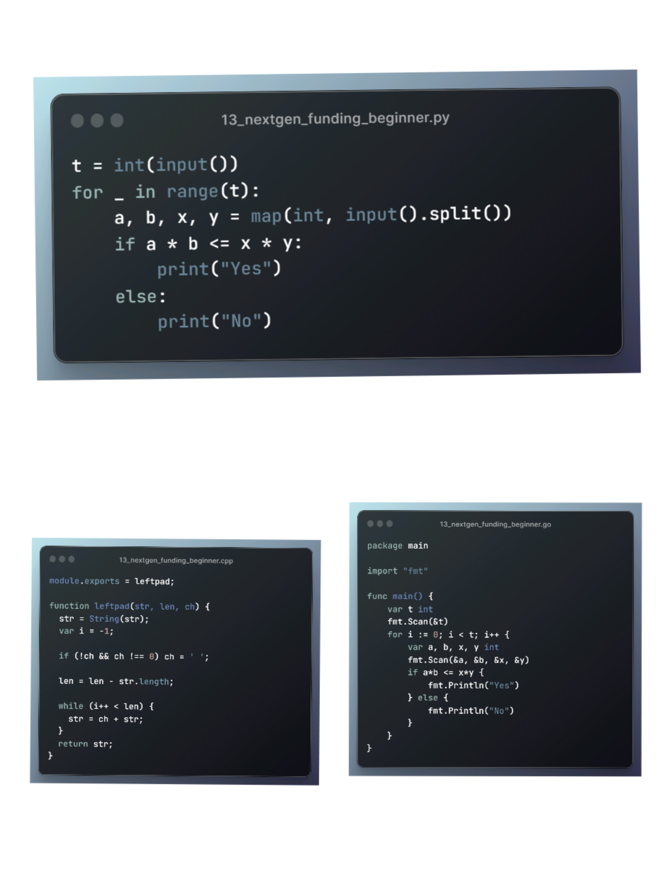
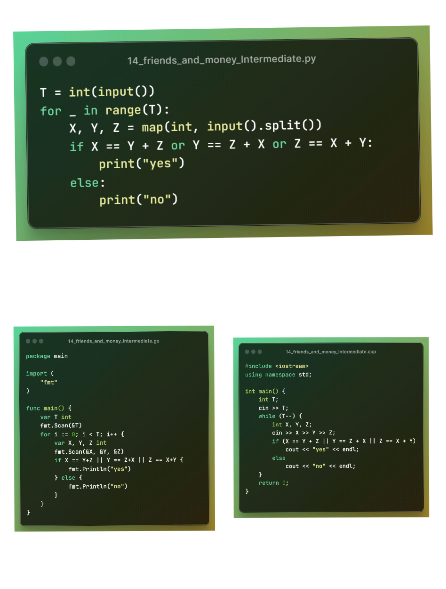

<!--Header-->


---

<!--ACC45DAYSOFCODE-2023-->
<h1>ACC45DAYSOFCODE-2023</h1>

> This is my 45 days of code challenge repository organize by Amity Coding Club that is official club of <a href=https://www.amity.edu/gwalior>Amity University Gwalior</a>

<!--Table-->
<h2>Progress table</h2>

#### **Contributing:**

Please take a quick look at the [contribution guidelines](/CONTRIBUTING.md) first. Thanks to all [contributors](https://github.com/AshishBytes/ACC45DAYSOFCODE-2023/graphs/contributors); you rock!

---

|                  Days and Level                   | Cpp | Python | JavaScript | Golang |
| :-----------------------------------------------: | :-: | :----: | :--------: | :----: |
|          [Day - 01 - Beginner](#day-01)           | ✅  |   ✅   |     ✅     |   ✅   |
|          [Day - 02 - Beginner](#day-02)           | ✅  |   ✅   |     ✅     |   ✅   |
|          [Day - 03 - Beginner](#day-03)           | ✅  |   ✅   |     ✅     |   ✅   |
|     [Day - 04 - Beginner](#day-04---beginner)     | ✅  |   ✅   |     ✅     |   ✅   |
| [Day - 04 - Intermediate](#day-04---intermediate) | ✅  |   ✅   |     ❌     |   ❌   |
|     [Day - 05 - Beginner](#day-05---beginner)     | ✅  |   ✅   |     ✅     |   ✅   |
| [Day - 05 - Intermediate](#day-05---intermediate) | ✅  |   ✅   |     ❌     |   ✅   |
|     [Day - 06 - Beginner](#day-06---beginner)     | ✅  |   ✅   |     ✅     |   ✅   |
| [Day - 06 - Intermediate](#day-06---intermediate) | ❌  |   ❌   |     ❌     |   ❌   |
|     [Day - 07 - Beginner](#day-07---beginner)     | ✅  |   ❌   |     ❌     |   ❌   |
| [Day - 07 - Intermediate](#day-07---intermediate) | ❌  |   ❌   |     ❌     |   ❌   |
|     [Day - 08 - Beginner](#day-08---beginner)     | ✅  |   ✅   |     ❌     |   ✅   |
| [Day - 08 - Intermediate](#day-08---intermediate) | ✅  |   ✅   |     ❌     |   ❌   |
|     [Day - 09 - Beginner](#day-09---beginner)     | ❌  |   ❌   |     ❌     |   ❌   |
| [Day - 09 - Intermediate](#day-09---intermediate) | ✅  |   ❌   |     ❌     |   ✅   |
|     [Day - 10 - Beginner](#day-10---beginner)     | ✅  |   ✅   |     ❌     |   ✅   |
| [Day - 10 - Intermediate](#day-10---intermediate) | ✅  |   ✅   |     ❌     |   ✅   |
|     [Day - 11 - Beginner](#day-11---beginner)     | ❌  |   ❌   |     ❌     |   ❌   |
| [Day - 11 - Intermediate](#day-11---intermediate) | ✅  |   ✅   |     ❌     |   ❌   |
|     [Day - 12 - Beginner](#day-12---beginner)     | ✅  |   ✅   |     ✅     |   ✅   |
| [Day - 12 - Intermediate](#day-12---intermediate) | ✅  |   ✅   |     ❌     |   ✅   |
|     [Day - 13 - Beginner](#day-13---beginner)     | ✅  |   ✅   |     ❌     |   ✅   |
| [Day - 13 - Intermediate](#day-13---intermediate) | ❌  |   ❌   |     ❌     |   ❌   |
|     [Day - 14 - Beginner](#day-14---beginner)     | ❌  |   ❌   |     ❌     |   ❌   |
| [Day - 14 - Intermediate](#day-14---intermediate) | ✅  |   ✅   |     ❌     |   ✅   |
|     [Day - 15 - Beginner](#day-15---beginner)     | ✅  |   ✅   |     ❌     |   ✅   |
| [Day - 15 - Intermediate](#day-15---intermediate) | ✅  |   ❌   |     ❌     |   ✅   |
|     [Day - 16 - Beginner](#day-16---beginner)     | ✅  |   ✅   |     ❌     |   ✅   |
| [Day - 16 - Intermediate](#day-16---intermediate) | ❌  |   ❌   |     ❌     |   ❌   |
|     [Day - 17 - Beginner](#day-17---beginner)     | ❌  |   ❌   |     ❌     |   ❌   |
| [Day - 17 - Intermediate](#day-17---intermediate) | ❌  |   ❌   |     ✅     |   ❌   |
|     [Day - 18 - Beginner](#day-18---beginner)     | ✅  |   ❌   |     ❌     |   ❌   |
| [Day - 18 - Intermediate](#day-18---intermediate) | ❌  |   ❌   |     ❌     |   ❌   |
|     [Day - 19 - Beginner](#day-19---beginner)     | ✅  |   ❌   |     ❌     |   ❌   |
| [Day - 19 - Intermediate](#day-19---intermediate) | ❌  |   ❌   |     ❌     |   ❌   |
|     [Day - 20 - Beginner](#day-20---beginner)     | ✅  |   ❌   |     ❌     |   ❌   |
| [Day - 20 - Intermediate](#day-20---intermediate) | ❌  |   ❌   |     ❌     |   ❌   |
|     [Day - 21 - Beginner](#day-21---beginner)     | ✅  |   ❌   |     ❌     |   ❌   |
| [Day - 21 - Intermediate](#day-21---intermediate) | ❌  |   ❌   |     ❌     |   ❌   |
|     [Day - 22 - Beginner](#day-22---beginner)     | ✅  |   ❌   |     ❌     |   ❌   |
| [Day - 22 - Intermediate](#day-22---intermediate) | ✅  |   ❌   |     ❌     |   ❌   |
|     [Day - 23 - Beginner](#day-23---beginner)     | ✅  |   ❌   |     ❌     |   ❌   |
| [Day - 23 - Intermediate](#day-23---intermediate) | ❌  |   ❌   |     ❌     |   ❌   |
|     [Day - 24 - Beginner](#day-24---beginner)     | ✅  |   ❌   |     ❌     |   ❌   |
| [Day - 24 - Intermediate](#day-24---intermediate) | ❌  |   ❌   |     ❌     |   ❌   |

After that, I will not update the readme file; I will just upload the programs to the C++ folder.
<br>

---

<br>

<!--Day - 01-->
<h2>Day-01</h2>
<details>
<summary>Tasks for Day 01:</summary>
<div>
  <li>Recently, Chef visited his doctor. The doctor advised Chef to drink at least 2000 ml of water each day.

Chef drank X ml of water today. Determine if Chef followed the doctor's advice or not.

<code>Input Format</code>:

- The first line contains a single integer T — the number of test cases. Then the test cases follow.
- The first and only line of each test case contains one integer X — the amount of water Chef drank today.
  <code>Output Format</code>:
- For each test case, output YES if Chef followed the doctor's advice of drinking at least 2000 ml of water. Otherwise, output NO.

- You may print each character of the string in uppercase or lowercase (for example, the strings YES, yEs, yes, and yeS will all be treated as identical).

<code>Constraints</code>:

- 1 <= T <= 2000
- 1 <= X <= 4000

<code>Explanation</code>:
Test case 1: Chef followed the doctor's advice since he drank 2999 ml of water which is >=2000 ml.

Test case 2: Chef did not follow the doctor's advice since he drank
1450 ml of water which is < 2000 ml.

Test case 3: Chef followed the doctor's advice since he drank 2000 ml of water which is >= 2000 ml.</li>

</ul>
</div>
<p>For more details, You can find the full problem description on CodeChef's website:
<a href="https://www.codechef.com/practice/PCL05/problems/WATERCONS">Water Consumption Problem Description</a>.</p>
</details>

<h2>Solution/Codes</h2>
<li><a href="C++/01_watercons.cpp"><code>C++</code></a></li>
<li><a href="Python/01_watercons.py"><code>Python</code></a></li>
<li><a href="JavaScript/01_watercons.js"><code>JavaScript</code></a></li>
<li><a href="Golang/01_watercons.go"><code>Golang</code></a></li>
<p>Here's an example of using the <code>Python</code> programming language:</p>

```python
T = int(input())
for _ in range(T):
    X = int(input())
    if X >= 2000:
        print("YES")
    else:
        print("NO")
```

<details>
<summary>Images</summary>

</details>
<br>

[🔝 Back to Table](#progress-table)

---

<br>

<!--Day - 02-->
<h2>Day-02</h2>
<details>
<summary>Tasks for Day 02:</summary>
<div>
<ul>
  <li>Chef has X 5 rupee coins and Y 10 rupee coins. Chef goes to a shop to buy chocolates for Chefina where each chocolate costs Z rupees. Find the maximum number of chocolates that Chef can buy for Chefina.</li>
  <li>
    <code>Input Format</code>:
    <ul>
      <li>The first line contains a single integer T — the number of test cases. Then the test cases follow.</li>
      <li>The first and only line of each test case contains three integers X, Y, and Z — the number of 5 rupee coins, the number of 10 rupee coins, and the cost of each chocolate.</li>
    </ul>
  </li>
  <li>
    <code>Output Format</code>:
    <ul>
      <li>For each test case, output the maximum number of chocolates that Chef can buy for Chefina.</li>
    </ul>
  </li>
  <li>
    <code>Constraints</code>:
    <ul>
      <li>1 ≤ T ≤ 100</li>
      <li>1 ≤ X, Y, Z ≤ 1000</li>
    </ul>
  </li>
  <li>
    <code>Sample 1</code>:
    <ul>
      <li><code>Input</code></li>
      <li><code>Output</code></li>
      <li>4</li>
      <li>10 10 10</li>
      <li>3 1 8</li>
      <li>8 1 3</li>
      <li>4 4 1000</li>
      <li><code>Explanation</code>:</li>
      <li>Test case 1: Chef has 10⋅5+10⋅10=150 rupees in total. Since each chocolate costs 10 rupees, Chef can spend all 150 rupees and buy 15 chocolates for Chefina.</li>
      <li>Test case 2: Chef has 3⋅5+1⋅10=25 rupees in total. Since each chocolate costs 8 rupees, Chef can buy a maximum of 3 chocolates for Chefina, leaving him with 1 rupee.</li>
      <li>Test case 3: Chef has 8⋅5+1⋅10=50 rupees in total. Since each chocolate costs 3 rupees, Chef can buy a maximum of 16 chocolates for Chefina, leaving him with 2 rupees.</li>
      <li>Test case 4: Chef has 4⋅5+4⋅10=60 rupees in total. Since each chocolate costs 1000 rupees, Chef can buy no chocolate for Chefina, leaving him with 60 rupees.</li>
    </ul>
  </li>
</ul>
</div>
<p>For more details, You can find the full problem description on CodeChef's website:
<a href="https://www.codechef.com/practice/PCBM01/problems/CCHOCOLATES">Chef and Chocolates Problem Description</a>.</p>
</details>

<h2>Solution/Codes</h2>
<li><a href="C++/02_cchocolates.cpp"><code>C++</code></a></li>
<li><a href="Python/02_cchocolates.py"><code>Python</code></a></li>
<li><a href="JavaScript/02_cchocolates.js"><code>JavaScript</code></a></li>
<li><a href="Golang/02_cchocolates.go"><code>Golang</code></a></li>
<p>Here's an example of using the <code>Golang</code> programming language:</p>

```go
package main

import "fmt"

func main() {
    var T, X, Y, Z int
    fmt.Scan(&T)
    for i := 0; i < T; i++ {
        fmt.Scan(&X, &Y, &Z)
        totalRupees := X*5 + Y*10
        maxChocolates := totalRupees / Z
        fmt.Println(maxChocolates)
    }
}
```

<details>
<summary>Images</summary>

</details>
<br>

[🔝 Back to Table](#progress-table)

---

<br>

<!--Day - 03-->
<h2>Day-03</h2>
<details>
<summary>Tasks for Day 03:</summary>
<div>
<ul>
  <li>
    <strong>Problem</strong>
    <p>Chef's coding class is very famous in Chefland. This year X students joined his class, and each student will require one chair to sit on. Chef already has Y chairs in his class. Determine the minimum number of new chairs Chef must buy so that every student is able to get one chair to sit on.</p>
  </li>
  <li>
    <strong>Input Format</strong>
    <p>The first line contains a single integer T — the number of test cases. Then the test cases follow.</p>
    <p>The first and only line of each test case contains two integers X and Y — the number of students in the class and the number of chairs Chef already has.</p>
  </li>
  <li>
    <strong>Output Format</strong>
    <p>For each test case, output the minimum number of extra chairs Chef must buy so that every student gets one chair.</p>
  </li>
  <li>
    <strong>Constraints</strong>
    <p>1 ≤ T ≤ 1000</p>
    <p>0 ≤ X, Y ≤ 100</p>
  </li>
  <li>
    <strong>Sample 1:</strong>
    <ul>
      <li>
        <strong>Input</strong>
        <p>4</p>
        <p>20 14</p>
        <p>41 41</p>
        <p>35 0</p>
        <p>50 100</p>
      </li>
      <li>
        <strong>Output</strong>
        <p>6</p>
        <p>0</p>
        <p>35</p>
        <p>0</p>
      </li>
      <li>
        <strong>Explanation</strong>
        <p>Test case 1: There are 20 students in the class, and Chef has 14 chairs already. Therefore Chef must buy 6 more chairs.</p>
        <p>Test case 2: There are 41 students in the class, and Chef already has exactly 41 chairs. Therefore Chef does not need to buy any more chairs.</p>
        <p>Test case 3: There are 35 students in the class, and Chef has no chairs initially. Therefore Chef must buy 35 chairs.</p>
      </li>
    </ul>
  </li>
</ul>
</div>
<p>For more details, You can find the full problem description on CodeChef's website:
<a href="https://www.codechef.com/problems/CHAIRS_">Chairs Requirement Problem Description</a>.</p>
</details>

<h2>Solution/Codes</h2>
<li><a href="C++/03_chair_distribution.cpp"><code>C++</code></a></li>
<li><a href="Python/03_chair_distribution.py"><code>Python</code></a></li>
<li><a href="JavaScript/03_chair_distribution.js"><code>JavaScript</code></a></li>
<li><a href="Golang/03_chair_distribution.go"><code>Golang</code></a></li>
<p>Here's an example of using the <code>JavaScript</code> programming language:</p>

```js
const readline = require("readline");

const rl = readline.createInterface({
  input: process.stdin,
  output: process.stdout,
});

let T;
let testCases = [];

rl.question("", (t) => {
  T = parseInt(t);
  readInput();
});

function readInput() {
  if (testCases.length < T) {
    rl.question("", (input) => {
      const [X, Y] = input.split(" ").map(Number);
      testCases.push({ X, Y });
      readInput();
    });
  } else {
    processInput();
  }
}

function processInput() {
  for (let i = 0; i < T; i++) {
    const { X, Y } = testCases[i];
    const extraChairs = Math.max(0, X - Y);
    console.log(extraChairs);
  }
  rl.close();
}
```

<details>
<summary>Images</summary>

</details>
<br>

[🔝 Back to Table](#progress-table)

---

<br>

<!--Day - 04-->
<!--Beginner-->
<h2>Day-04 - Beginner</h2>
<details>
<summary>Today's Beginner problem:</summary>
<div>
<ul>
  <li>Chef has started working at the candy store. The store has 100 chocolates in total.</li>
  <li>Chef’s daily goal is to sell X chocolates. For each chocolate sold, he will get 1 rupee. However, if Chef exceeds his daily goal, he gets 2 rupees per chocolate for each extra chocolate.</li>
  <li>If Chef sells Y chocolates in a day, find the total amount he made.</li>
  <li>
    <code>Input Format</code>:
    <ul>
      <li>The first line of input will contain a single integer T, denoting the number of test cases.</li>
      <li>Each test case consists of two space-separated integers X and Y — the daily goal of Chef and the number of chocolates he actually sells.</li>
    </ul>
  </li>
  <li>
    <code>Output Format</code>:
    <ul>
      <li>For each test case, output on a new line the total amount Chef made in a day.</li>
    </ul>
  </li>
  <li>
    <code>Constraints</code>:
    <ul>
      <li>1 ≤ T ≤ 100</li>
      <li>1 ≤ X, Y ≤ 10</li>
    </ul>
  </li>
  <li>
    <code>Sample 1:</code>
    <ul>
      <li>
        <code>Input</code>
        <p>4</p>
        <p>3 1</p>
        <p>5 5</p>
        <p>4 7</p>
        <p>2 3</p>
      </li>
      <li>
        <code>Output</code>
        <p>1</p>
        <p>5</p>
        <p>10</p>
        <p>4</p>
      </li>
      <li>
        <code>Explanation</code>:
        <p>Test case 1: Chef's daily goal was 3. Since he sold only 1 chocolate, he'll get only 1 rupee.</p>
        <p>Test case 2: Chef's daily goal was 5. Since he sold 5 chocolates, he'll get 5 rupees.</p>
        <p>Test case 3: Chef's daily goal was 4. Since he sold 7 chocolates, he'll get 4 rupees for the 4 chocolates as his daily goal and 2 rupees per chocolate for the extra 3 chocolates. The total amount he gets is 4 + 3 * 2 = 10.</p>
        <p>Test case 4: Chef's daily goal was 2. Since he sold 3 chocolates, he'll get 2 rupees for the 2 chocolates as his daily goal and 2 rupees per chocolate for the extra 1 chocolate. The total amount he gets is 2 + 1 * 2 = 4.</p>
      </li>
    </ul>
  </li>
</ul>
</div>
<p>For more details, You can find the full problem description on CodeChef's website:
<a href="https://www.codechef.com/practice/PCBM01/problems/CANDYSTORE">Candy Store Problem Description</a>.</p>
</details>

<h2>Solution/Codes</h2>
<li><a href="C++/04_candy_store_beginner.cpp"><code>C++</code></a></li>
<li><a href="Python/04_candy_store_beginner.py"><code>Python</code></a></li>
<li><a href="JavaScript/04_candy_store_beginner.js"><code>JavaScript</code></a></li>
<li><a href="Golang/04_candy_store_beginner.go"><code>Golang</code></a></li>
<p>Here's an example of using the <code>C++</code> programming language:</p>

```cpp
#include <iostream>
using namespace std;

int main() {
    int t;
    cin >> t;
    while (t--) {
        int x, y;
        cin >> x >> y;
        if (x >= y) {
            cout << y;
        } else {
            cout << x + 2 * (y - x);
        }
        cout << endl;
    }
    return 0;
}
```

<details>
<summary>Images</summary>

</details>
<br>

[🔝 Back to Table](#progress-table)

---

<br>
<!--Intermediate-->
<h2>Day-04 - Intermediate</h2>
<details>
<summary>Today's Intermediate problem:</summary>
<div>
  <li>
    <strong>Problem Name:</strong> "Hare and Tortoise Race"
  </li>
  <li>
    <strong>Problem Description:</strong> The tortoise and the hare decide to run a race, yet again. This time around, however, the hare has gotten a bit smarter! The racetrack is a straight line, 𝐿 meters long. The tortoise moves at 𝑉1 meters per second, while the hare moves at 𝑉2 meters per second. It is known that 𝑉1 < 𝑉2, that is, the hare is strictly faster. The hare still wants to be a bit lazy, so it decides to give the tortoise a headstart — the hare will wait for an integer number of seconds before starting to run. Unfortunately, the animals' measuring devices aren't up to par — they can only measure in integer seconds, and will round up — so for example...
  </li>
  <li>
    <strong>Input Format:</strong> The first line of input will contain a single integer 𝑇, denoting the number of test cases. The first and only line of each test case contains three space-separated integers 𝐿, 𝑉1, and 𝑉2 — the length of the racetrack, the tortoise's speed, and the hare's speed.
  </li>
  <li>
    <strong>Output Format:</strong> For each test case, output on a new line the longest time the hare can wait, while still being able to win the race.
  </li>
  <li>
    <strong>Constraints:</strong>
    <ul>
      <li>1 ≤ 𝑇 ≤ 10,000</li>
      <li>1 ≤ 𝐿 ≤ 1,000</li>
      <li>1 ≤ 𝑉1 < 𝑉2 ≤ 1,000</li>
    </ul>
  </li>
  <li>
    <strong>Sample Input:</strong>
    <pre>
      5
      10 2 3
      10 2 4
      15 3 5
      8 1 20
      14 5 6
    </pre>
  </li>
  <li>
    <strong>Sample Output:</strong>
    <pre>
      0
      1
      1
      6
      -1
    </pre>
  </li>
  <li>
    <strong>Explanation:</strong> Test case 1: Here, 𝐿 = 10, 𝑉1 = 2, 𝑉2 = 3. The tortoise takes 5 seconds to finish the race, while the hare takes 3.33 seconds; which rounds up to 4. So, the hare cannot wait at all before starting.</li>
</ul>
</div>
<p>For more details, You can find the full problem description on CodeChef's website:
<a href="https://www.codechef.com/START101D/problems/SMARTER">Work Smarter, Not Harder Problem Description</a>.</p>
</details>

<h2>Solution/Codes</h2>
<li><a href="C++/04_MindfulRace_Intermediate.cpp"><code>C++</code></a></li>
<li><a href="Python/04_MindfulRace_Intermediate.py"><code>Python</code></a></li>
<li><a href="JavaScript/04_MindfulRace_Intermediate.js"><code>❌ JavaScript</code></a></li>
<li><a href="Golang/04_MindfulRace_Intermediate.go"><code>❌ Golang</code></a></li>
<p>Here's an example of using the <code>C++</code> programming language:</p>

```cpp
#include <iostream>
#include <math.h>
#include <iomanip>
using namespace std;

int main() {
    int t;
    float L, v1, v2;
    cin >> t;
    while (t--) {
        cin >> L >> v1 >> v2;
        setprecision(3);
        int t1 = ceil(L / v1);
        int t2 = ceil(L / v2);
        if (t1 > t2) {
            if (t1 == t2 + 1)
                cout << "0" << endl;
            else
                cout << t1 - t2 - 1 << endl;
        } else if (t1 == t2)
            cout << "-1" << endl;
    }
    return 0;
}
```

<details>
<summary>Images</summary>

</details>
<br>

[🔝 Back to Table](#progress-table)

---

<br>

<!--Day - 05-->
<!--Beginner-->
<h2>Day-05 - Beginner</h2>
<details>
<summary>Today's Beginner problem:</summary>
<div>
  <li>
    <strong>Problem:</strong> Chef's phone shows a Battery Low notification if the battery level is 15% or less.
  </li>
  <li>
    <strong>Input Format:</strong>
    <ul>
      <li>The first line will contain T, the number of test cases.</li>
      <li>Each test case contains a single line of input, an integer X, denoting the battery level of the phone.</li>
    </ul>
  </li>
  <li>
    <strong>Output Format:</strong>
    <ul>
      <li>For each test case, output in a single line "Yes" if the battery level is 15% or below. Otherwise, print "No".</li>
    </ul>
  </li>
  <li>
    <strong>Constraints:</strong>
    <ul>
      <li>1 ≤ T ≤ 100</li>
      <li>1 ≤ X ≤ 100</li>
    </ul>
  </li>
  <li>
    <strong>Sample Input:</strong>
    <pre>
      3
      15
      3
      65
    </pre>
  </li>
  <li>
    <strong>Sample Output:</strong>
    <pre>
      Yes
      Yes
      No
    </pre>
  </li>
  <li>
    <strong>Explanation:</strong>
    <ul>
      <li>Test Case 1: The battery level is 15%. Thus, it would show a battery low notification.</li>
      <li>Test Case 2: The battery level is 3%, which is less than 15%. Thus, it would show a battery low notification.</li>
      <li>Test Case 3: The battery level is 65%, which is greater than 15%. Thus, it would not show a battery low notification.</li>
    </ul>
  </li>
</ul>
</div>
<p>For more details, You can find the full problem description on CodeChef's website:
<a href="https://www.codechef.com/problems/BATTERYLOW">Battery Low Problem Description</a>.</p>
</details>

<h2>Solution/Codes</h2>
<li><a href="C++/05_battery_low_beginner.cpp"><code>C++</code></a></li>
<li><a href="Python/05_battery_low_beginner.py"><code>Python</code></a></li>
<li><a href="JavaScript/05_battery_low_beginner.js"><code>JavaScript</code></a></li>
<li><a href="Golang/05_battery_low_beginner.go"><code>Golang</code></a></li>
<p>Here's an example of using the <code>Python</code> programming language:</p>

```python
t = int(input())
for _ in range(t):
    x = int(input())
    if x <= 15:
        print("Yes")
    else:
        print("No")
```

<details>
<summary>Images</summary>

</details>
<br>

[🔝 Back to Table](#progress-table)

---

<br>
<!--Intermediate-->
<h2>Day-05 - Intermediate</h2>
<details>
<summary>Today's Intermediate problem:</summary>
<div>
  <li>
    <strong>Problem:</strong> You and your friend are playing a game with hoops. There are N hoops (where N is odd) in a row. You jump into hoop 1, and your friend jumps into hoop N. Then you jump into hoop 2, and after that, your friend jumps into hoop (N-1), and so on. The process ends when someone cannot make the next jump because the hoop is occupied by the other person. Find the last hoop that will be jumped into.
  </li>
  <li>
    <strong>Input Format:</strong>
    <ul>
      <li>The first line contains an integer T, the number of test cases. Then the test cases follow.</li>
      <li>Each test case contains a single line of input, a single integer N.</li>
    </ul>
  </li>
  <li>
    <strong>Output Format:</strong>
    <ul>
      <li>For each testcase, output in a single line the answer to the problem.</li>
    </ul>
  </li>
  <li>
    <strong>Constraints:</strong>
    <ul>
      <li>1 ≤ T ≤ 10^5</li>
      <li>1 ≤ N < 2 * 10^5 (N is odd)</li>
    </ul>
  </li>
  <li>
    <strong>Sample Input:</strong>
    <pre>
      2
      1
      3
    </pre>
  </li>
  <li>
    <strong>Sample Output:</strong>
    <pre>
      1
      2
    </pre>
  </li>
  <li>
    <strong>Explanation:</strong>
    <ul>
      <li>Test Case 1: Since there is only 1 hoop, that's the only one to be jumped into.</li>
      <li>Test Case 2: The first player jumps into hoop 1. The second player jumps into hoop 3 and finally the first player jumps into hoop 2. Then the second player cannot make another jump, so the process stops.</li>
    </ul>
  </li>
</ul>
</div>
<p>For more details, You can find the full problem description on CodeChef's website:
<a href="https://www.codechef.com/practice/LP1TO201/problems/HOOPS">Hoop Jump Problem Description</a>.</p>
</details>

<h2>Solution/Codes</h2>
<li><a href="C++/05_jumping_hoops_Intermediate.cpp"><code>C++</code></a></li>
<li><a href="Python/05_jumping_hoops_Intermediate.py"><code>Python</code></a></li>
<li><a href="JavaScript/05_jumping_hoops_Intermediate.js"><code>❌ JavaScript</code></a></li>
<li><a href="Golang/05_jumping_hoops_Intermediate.go"><code>Golang</code></a></li>
<p>Here's an example of using the <code>Python</code> programming language:</p>

```python
t = int(input())
for _ in range(t):
    n = int(input())
    print((n + 1) // 2)
```

<details>
<summary>Images</summary>

</details>
<br>

[🔝 Back to Table](#progress-table)

---

<br>

<!--Day - 06-->
<!--Beginner-->
<h2>Day-06 - Beginner</h2>
<details>
<summary>Today's Beginner problem:</summary>
<div>
  <li>
    <strong>Problem Name:</strong> Minimum Cars for Friends
  </li>
  <li>
    <strong>Description:</strong> A single car can accommodate at most 4 people. N friends want to go to a restaurant for a party. Find the minimum number of cars required to accommodate all the friends.
  </li>
  <li>
    <strong>Input Format:</strong>
    <ul>
      <li>The first line contains a single integer T, the number of test cases. Then the test cases follow.</li>
      <li>Each test case contains a single line of input, a single integer N - denoting the number of friends.</li>
    </ul>
  </li>
  <li>
    <strong>Output Format:</strong>
    <ul>
      <li>For each test case, output the minimum number of cars required to accommodate all the friends.</li>
    </ul>
  </li>
  <li>
    <strong>Constraints:</strong>
    <ul>
      <li>1 ≤ T ≤ 1000</li>
      <li>2 ≤ N ≤ 1000</li>
    </ul>
  </li>
  <li>
    <strong>Sample Input:</strong>
    <pre>
      4
      4
      2
      7
      98
    </pre>
  </li>
  <li>
    <strong>Sample Output:</strong>
    <pre>
      1
      1
      2
      25
    </pre>
  </li>
  <li>
    <strong>Explanation:</strong>
    <ul>
      <li>Test Case 1: There are only 4 friends and a single car can accommodate 4 people. Thus, only 1 car is required.</li>
      <li>Test Case 2: There are only 2 friends and a single car can accommodate 4 people. Thus, only 1 car is required.</li>
      <li>Test Case 3: There are 7 friends and 2 cars can accommodate 8 people. Thus, 2 cars are required.</li>
    </ul>
  </li>
</ul>
</div>
<p>For more details, You can find the full problem description on CodeChef's website:
<a href="https://www.codechef.com/problems/MINCARS">Minimum Cars required Problem Description</a>.</p>
</details>

<h2>Solution/Codes</h2>
<li><a href="C++/06_minimum_cars_beginner.cpp"><code>C++</code></a></li>
<li><a href="Python/06_minimum_cars_beginner.py"><code>Python</code></a></li>
<li><a href="JavaScript/06_minimum_cars_beginner.js"><code>JavaScript</code></a></li>
<li><a href="Golang/06_minimum_cars_beginner.go"><code>Golang</code></a></li>
<p>Here's an example of using the <code>Golang</code> programming language:</p>

```go
package main

import "fmt"

func main() {
    var t int
    fmt.Scan(&t)
    for i := 0; i < t; i++ {
        var n int
        fmt.Scan(&n)
        fmt.Println((n + 3) / 4)
    }
}
```

<details>
<summary>Images</summary>

</details>
<br>

[🔝 Back to Table](#progress-table)

---

<br>
<!--Intermediate-->
<h2>Day-06 - Intermediate</h2>
<details>
<summary>Today's Intermediate problem:</summary>
<div>
  <li>
    <strong>Problem Name:</strong> Rearrange Digits for Multiple of 5
  </li>
  <li>
    <strong>Description:</strong> Given a positive integer N, MoEngage wants you to determine if it is possible to rearrange the digits of N (in decimal representation) and obtain a multiple of 5. For example, when N = 108, we can rearrange its digits to construct 180 = 36 * 5, which is a multiple of 5.
  </li>
  <li>
    <strong>Input Format:</strong>
    <ul>
      <li>The first line contains an integer T, the number of test cases. The description of the T test cases follows.</li>
      <li>Each test case consists of two lines:
        <ul>
          <li>The first line contains a single integer D, the number of digits in N.</li>
          <li>The second line consists of a string of length D, the number N (in decimal representation). It is guaranteed that the string does not contain leading zeroes and consists only of the characters 0, 1, ..., 9.</li>
        </ul>
      </li>
    </ul>
  </li>
  <li>
    <strong>Output Format:</strong>
    <ul>
      <li>For each test case, print "Yes" if it is possible to rearrange the digits of N so that it becomes a multiple of 5. Otherwise, print "No".</li>
    </ul>
  </li>
  <li>
    <strong>Constraints:</strong>
    <ul>
      <li>1 ≤ T ≤ 1000</li>
      <li>1 ≤ D ≤ 1000</li>
      <li>1 ≤ N < 10^1000</li>
      <li>Sum of D over all test cases ≤ 1000</li>
    </ul>
  </li>
  <li>
    <strong>Sample Input:</strong>
    <pre>
      3
      3
      115
      3
      103
      3
      119
    </pre>
  </li>
  <li>
    <strong>Sample Output:</strong>
    <pre>
      Yes
      Yes
      No
    </pre>
  </li>
  <li>
    <strong>Explanation:</strong>
    <ul>
      <li>Test Case 1: The given number is already divisible by 5, therefore the answer is "Yes".</li>
      <li>Test Case 2: We can obtain 310 = 62 * 5 by rearranging the digits of 103, so the answer is "Yes".</li>
      <li>Test Case 3: The only numbers that can be obtained by rearranging the digits of 119 are {119, 191, 911}. None of these numbers are multiples of 5, so the answer is "No".</li>
    </ul>
  </li>
</ul>
</div>
<p>For more details, You can find the full problem description on CodeChef's website:
<a href="https://www.codechef.com/problems/DIGARR">Rearranging digits to get a multiple of 5 Problem Description</a>.</p>
</details>

<h2>Solution/Codes</h2>
<li><a href="C++/06_rearrange_digits_Intermediate.cpp"><code>❌ C++</code></a></li>
<li><a href="Python/06_rearrange_digits_Intermediate.py"><code>❌ Python</code></a></li>
<li><a href="JavaScript/06_rearrange_digits_Intermediate.js"><code>❌ JavaScript</code></a></li>
<li><a href="Golang/06_rearrange_digits_Intermediate.go"><code>❌ Golang</code></a></li>
<p>Here's an example of using the <code>JavaScript</code> programming language:</p>

```js
//❌
```

<details>
<summary>Images</summary>

</details>
<br>

[🔝 Back to Table](#progress-table)

---

<br>

<!--Day - 07-->
<!--Beginner-->
<h2>Day-07 - Beginner</h2>
<details>
<summary>Today's Beginner problem:</summary>
<div>
  <li>
    <strong>Problem:</strong> Chef categorises an Instagram account as spam if the following count of the account is more than 10 times the count of followers. Given the following and follower count of an account as X and Y respectively, find whether it is a spam account.
  </li>
  <li>
    <strong>Input Format:</strong>
    <ul>
      <li>The first line of input will contain a single integer T, denoting the number of test cases.</li>
      <li>Each test case consists of two space-separated integers X and Y — the following and follower count of an account, respectively.</li>
    </ul>
  </li>
  <li>
    <strong>Output Format:</strong>
    <ul>
      <li>For each test case, output on a new line, YES, if the account is spam and NO otherwise.</li>
    </ul>
  </li>
  <li>
    <strong>Constraints:</strong>
    <ul>
      <li>1 ≤ T ≤ 100</li>
      <li>1 ≤ X, Y ≤ 100</li>
    </ul>
  </li>
  <li>
    <strong>Sample Input:</strong>
    <pre>
      4
      1 10
      10 1
      11 1
      97 7
    </pre>
  </li>
  <li>
    <strong>Sample Output:</strong>
    <pre>
      NO
      NO
      YES
      YES
    </pre>
  </li>
  <li>
    <strong>Explanation:</strong>
    <ul>
      <li>Test Case 1: The following count is 1 while the follower count is 10. Since the following count is not more than 10 times the follower count, the account is not spam.</li>
      <li>Test Case 2: The following count is 10 while the follower count is 1. Since the following count is not more than 10 times the follower count, the account is not spam.</li>
      <li>Test Case 3: The following count is 11 while the follower count is 1. Since the following count is more than 10 times the follower count, the account is spam.</li>
      <li>Test Case 4: The following count is 97 while the follower count is 7. Since the following count is more than 10 times the follower count, the account is spam.</li>
    </ul>
  </li>
</ul>
</div>
<p>For more details, You can find the full problem description on CodeChef's website:
<a href="https://www.codechef.com/problems/INSTAGRAM">Instagram Problem Description</a>.</p>
</details>

<h2>Solution/Codes</h2>
<li><a href="C++/07_spam_account_beginner.cpp"><code>C++</code></a></li>
<li><a href="Python/07_spam_account_beginner.py"><code>❌ Python</code></a></li>
<li><a href="JavaScript/07_spam_account_beginner.js"><code>❌ JavaScript</code></a></li>
<li><a href="Golang/07_spam_account_beginner.go"><code>❌ Golang</code></a></li>
<p>Here's an example of using the <code>C++</code> programming language:</p>

```cpp
#include <iostream>
using namespace std;

int main() {
    int t;
    cin >> t;
    while (t--) {
        int x, y;
        cin >> x >> y;
        cout << ((x > 10 * y) ? "YES" : "NO") << endl;
    }
    return 0;
}
```

<details>
<summary>Images</summary>

</details>
<br>

[🔝 Back to Table](#progress-table)

---

<br>
<!--Intermediate-->
<h2>Day-07 - Intermediate</h2>
<details>
<summary>Today's Intermediate problem:</summary>
<div>
  <li>
    <strong>Problem:</strong> The mayor of your city wants to throw a party and gather the favor of his people in different regions of the city. There are 3 distinct regions in the city, namely A, B, C, comprising of PA, PB, and PC number of people, respectively. However, people from region B are in conflict with people from regions A and C. Help the mayor invite the maximum number of people to the party without any conflicts.
  </li>
  <li>
    <strong>Input Format:</strong>
    <ul>
      <li>The first line contains a single integer T, the number of test cases. Then the test cases follow.</li>
      <li>For each test case, the first line contains three integers PA, PB, and PC, representing the number of people living in regions A, B, and C, respectively.</li>
    </ul>
  </li>
  <li>
    <strong>Output Format:</strong>
    <ul>
      <li>For each test case, output the maximum number of people that can be invited to the party without any conflicts.</li>
    </ul>
  </li>
  <li>
    <strong>Constraints:</strong>
    <ul>
      <li>1 ≤ T ≤ 1000</li>
      <li>1 ≤ PA, PB, PC ≤ 1000</li>
    </ul>
  </li>
  <li>
    <strong>Sample Input:</strong>
    <pre>
      3
      2 3 4
      1 5 2
      8 8 8
    </pre>
  </li>
  <li>
    <strong>Sample Output:</strong>
    <pre>
      6
      5
      16
    </pre>
  </li>
  <li>
    <strong>Explanation:</strong>
    <ul>
      <li>Test Case 1: The mayor can invite all the people from regions A and C. So the maximum number of people invited is 6.</li>
      <li>Test Case 2: The mayor can invite all the people from region B. So the maximum number of people invited is 5.</li>
      <li>Test Case 3: The mayor can invite all the people from any one region without conflicts, so the maximum number of people invited is 16.</li>
    </ul>
  </li>
</ul>
</div>
<p>For more details, You can find the full problem description on CodeChef's website:
<a href="https://www.codechef.com/problems/MAYOR_PARTY">Peaceful Party Problem Description</a>.</p>
</details>

<h2>Solution/Codes</h2>
<li><a href="C++/07_mayors_party_Intermediate.cpp"><code>❌ C++</code></a></li>
<li><a href="Python/07_mayors_party_Intermediate.py"><code>❌ Python</code></a></li>
<li><a href="JavaScript/07_mayors_party_Intermediate.js"><code>❌ JavaScript</code></a></li>
<li><a href="Golang/07_mayors_party_Intermediate.go"><code>❌ Golang</code></a></li>
<p>Here's an example of using the <code>Python</code> programming language:</p>

```python
    //❌
```

<details>
<summary>Images</summary>

</details>
<br>

[🔝 Back to Table](#progress-table)

---

<br>

<!--Day - 08-->
<!--Beginner-->
<h2>Day-08 - Beginner</h2>
<details>
<summary>Today's Beginner problem:</summary>
<div>
  <li>
    <strong>Problem:</strong> A geyser has a capacity of X litres of water, and a bucket has a capacity of Y litres of water. One person requires exactly 2 buckets of water to take a bath. Find the maximum number of people that can take a bath using water from one completely filled geyser.
  </li>
  <li>
    <strong>Input Format:</strong>
    <ul>
      <li>The first line contains an integer T, the number of test cases. Then the test cases follow.</li>
      <li>Each test case consists of a single line of input with two integers X and Y, representing the capacity of the geyser and the bucket, respectively.</li>
    </ul>
  </li>
  <li>
    <strong>Output Format:</strong>
    <ul>
      <li>For each test case, output the maximum number of people that can take a bath.</li>
    </ul>
  </li>
  <li>
    <strong>Constraints:</strong>
    <ul>
      <li>1 ≤ T ≤ 1000</li>
      <li>1 ≤ X, Y ≤ 100</li>
    </ul>
  </li>
  <li>
    <strong>Sample Input:</strong>
    <pre>
      4
      10 6
      25 1
      100 10
      30 40
    </pre>
  </li>
  <li>
    <strong>Sample Output:</strong>
    <pre>
      0
      12
      5
      0
    </pre>
  </li>
  <li>
    <strong>Explanation:</strong>
    <ul>
      <li>Test Case 1: One bucket has a capacity of 6 litres. This means that one person requires 2 * 6 = 12 litres of water to take a bath. Since this is less than the total water present in the geyser, 0 people can take a bath.</li>
      <li>Test Case 2: One bucket has a capacity of 1 litre. This means that one person requires 2 * 1 = 2 litres of water to take a bath. The total amount of water present in the geyser is 25 litres. Thus, 12 people can take a bath. Note that 1 litre of water would remain unused in the geyser.</li>
      <li>Test Case 3: One bucket has a capacity of 10 litres. This means that one person requires 2 * 10 = 20 litres of water to take a bath. The total amount of water present in the geyser is 100 litres. Thus, 5 people can take a bath. Note that 0 litres of water would remain unused in the geyser after this.</li>
    </ul>
  </li>
</ul>
</div>
<p>For more details, You can find the full problem description on CodeChef's website:
<a href="https://www.codechef.com/problems/BATH">Bath in Winters Problem Description</a>.</p>
</details>

<h2>Solution/Codes</h2>
<li><a href="C++/08_geyser_bath_capacity_beginner.cpp"><code>C++</code></a></li>
<li><a href="Python/08_geyser_bath_capacity_beginner.py"><code>Python</code></a></li>
<li><a href="JavaScript/08_geyser_bath_capacity_beginner.js"><code>❌ JavaScript</code></a></li>
<li><a href="Golang/08_geyser_bath_capacity_beginner.go"><code>Golang</code></a></li>
<p>Here's an example of using the <code>Golang</code> programming language:</p>

```go
package main

import "fmt"

func main() {
    var T int
    fmt.Scan(&T)
    for i := 0; i < T; i++ {
        var X, Y int
        fmt.Scan(&X, &Y)
        maxPeople := X / (2 * Y)
        fmt.Println(maxPeople)
    }
}
```

<details>
<summary>Images</summary>

</details>
<br>

[🔝 Back to Table](#progress-table)

---

<br>
<!--Intermediate-->
<h2>Day-08 - Intermediate</h2>
<details>
<summary>Today's Intermediate problem:</summary>
<div>
  <li>
    <strong>Problem:</strong> Chef decided to buy a new tablet. His budget is <i>B</i>, so he cannot buy a tablet whose price is greater than <i>B</i>. Other than that, he only has one criterion — the area of the tablet's screen should be as large as possible. Of course, the screen of a tablet is always a rectangle.
  </li>
  <li>
    <strong>Input:</strong>
    <ul>
      <li>The first line of the input contains a single integer <i>T</i> denoting the number of test cases. The description of <i>T</i> test cases follows.</li>
      <li>The first line of each test case contains two space-separated integers <i>N</i> and <i>B</i>.</li>
      <li><i>N</i> lines follow. For each <i>i</i> (1 ≤ <i>i</i> ≤ <i>N</i>), the <i>i</i>-th of these lines contains three space-separated integers <i>Wi</i>, <i>Hi</i>, and <i>Pi</i>.</li>
    </ul>
  </li>
  <li>
    <strong>Output:</strong>
    <ul>
      <li>For each test case, print a single line. If Chef cannot buy any tablet, it should contain the string "no tablet" (without quotes). Otherwise, it should contain a single integer — the maximum area of the screen of a tablet Chef can buy.</li>
    </ul>
  </li>
  <li>
    <strong>Constraints:</strong>
    <ul>
      <li>1 ≤ <i>T</i> ≤ 100</li>
      <li>1 ≤ <i>N</i> ≤ 100</li>
      <li>1 ≤ <i>B</i> ≤ 1,000,000</li>
      <li>1 ≤ <i>Wi</i>, <i>Hi</i> ≤ 10,000</li>
      <li>1 ≤ <i>Pi</i> ≤ 1,000,000 for each valid <i>i</i></li>
    </ul>
  </li>
  <li>
    <strong>Sample Input:</strong>
    <pre>
      3
      3 6
      3 4 4
      5 5 7
      5 2 5
      2 6
      3 6 8
      5 4 9
      1 10
      5 5 10
    </pre>
  </li>
  <li>
    <strong>Sample Output:</strong>
    <pre>
      12
      no tablet
      25
    </pre>
  </li>
  <li>
    <strong>Explanation:</strong>
    <ul>
      <li>Example case 1: The first tablet (with screen area 3 * 4 = 12) is the best option for Chef, since Chef cannot afford the second one, and the third one has a smaller screen.</li>
      <li>Example case 2: Chef's budget is 6, but all tablets have higher prices, so Chef cannot buy any tablet.</li>
      <li>Example case 3: The price of the only tablet is exactly equal to Chef's budget, so he is able to buy it.</li>
    </ul>
  </li>
</ul>
</div>
<p>For more details, You can find the full problem description on CodeChef's website:
<a href="https://www.codechef.com/problems/TABLET">Buying New Tablet Problem Description</a>.</p>
</details>

<h2>Solution/Codes</h2>
<li><a href="C++/08_tablet_shopping_dilemma_Intermediate.cpp"><code>C++</code></a></li>
<li><a href="Python/08_tablet_shopping_dilemma_Intermediate.py"><code>Python</code></a></li>
<li><a href="JavaScript/08_tablet_shopping_dilemma_Intermediate.js"><code>❌ JavaScript</code></a></li>
<li><a href="Golang/08_tablet_shopping_dilemma_Intermediate.go"><code>❌ Golang</code></a></li>
<p>Here's an example of using the <code>Python</code> programming language:</p>

```python
T = int(input())
for _ in range(T):
    N, B = map(int, input().split())
    max_area = -1
    for _ in range(N):
        W, H, P = map(int, input().split())
        if P <= B:
            area = W * H
            if area > max_area:
                max_area = area
    if max_area == -1:
        print("no tablet")
    else:
        print(max_area)
```

<details>
<summary>Images</summary>

</details>
<br>

[🔝 Back to Table](#progress-table)

---

<br>

<!--Day - 09-->
<!--Beginner-->
<h2>Day-09 - Beginner</h2>
<details>
<summary>Today's Beginner problem:</summary>
<div>

  <li>
    <strong>Problem:</strong> The summer is at its peak in Chefland. Chef is planning to purchase a water cooler to keep his room cool. He has two options available:
    <ul>
      <li>Rent a cooler at the cost of <i>X</i> coins per month.</li>
      <li>Purchase a cooler for <i>Y</i> coins.</li>
    </ul>
    Chef wonders what is the maximum number of months for which he can rent the cooler such that the cost of renting is strictly less than the cost of purchasing it.
  </li>
  <li>
    <strong>Input Format:</strong>
    <ul>
      <li>The first line of input will contain an integer <i>T</i> — the number of test cases. The description of <i>T</i> test cases follows.</li>
      <li>The first and only line of each test case contains two integers <i>X</i> and <i>Y</i>, as described in the problem statement.</li>
    </ul>
  </li>
  <li>
    <strong>Output Format:</strong>
    <ul>
      <li>For each test case, output the maximum number of months for which he can rent the cooler such that the cost of renting is strictly less than the cost of purchasing it.</li>
      <li>If Chef should not rent a cooler at all, output <i>0</i>.</li>
    </ul>
  </li>
  <li>
    <strong>Constraints:</strong>
    <ul>
      <li>1 ≤ <i>T</i> ≤ 1000</li>
      <li>1 ≤ <i>X</i>, <i>Y</i> ≤ 10<sup>9</sup></li>
    </ul>
  </li>
  <li>
    <strong>Sample Input:</strong>
    <pre>
      2
      5 12
      5 5
    </pre>
  </li>
  <li>
    <strong>Sample Output:</strong>
    <pre>
      2
      0
    </pre>
  </li>
  <li>
    <strong>Explanation:</strong>
    <ul>
      <li>Test case 1: Cost of renting the cooler = 5 coins per month. Cost of purchasing the cooler = 12 coins. So, Chef can rent the cooler for 2 months at the cost of 10 coins, which is strictly less than 12 coins.</li>
      <li>Test case 2: Cost of renting the cooler = 5 coins per month. Cost of purchasing the cooler = 5 coins. If Chef rents the cooler for 1 month, it will cost 5 coins, which is not strictly less than the cost of purchasing it. So, Chef should not rent the cooler.</li>
    </ul>
  </li>
</ul>
</div>
<p>For more details, You can find the full problem description on CodeChef's website:
<a href="https://www.codechef.com/problems/WATERCOOLER2">The Cooler Dilemma 2 Problem Description</a>.</p>
</details>

<h2>Solution/Codes</h2>
<li><a href="C++/09_cooling_chef_beginner.cpp"><code>❌ C++</code></a></li>
<li><a href="Python/09_cooling_chef_beginner.py"><code>❌ Python</code></a></li>
<li><a href="JavaScript/09_cooling_chef_beginner.js"><code>❌ JavaScript</code></a></li>
<li><a href="Golang/09_cooling_chef_beginner.go"><code>❌ Golang</code></a></li>
<p>Here's an example of using the <code>Python</code> programming language:</p>

```Python
    //❌
```

<details>
<summary>Images</summary>

</details>
<br>

[🔝 Back to Table](#progress-table)

---

<br>
<!--Intermediate-->
<h2>Day-09 - Intermediate</h2>
<details>
<summary>Today's Intermediate problem:</summary>
<div>
  <li>
    <strong>Problem:</strong> Chef recently started working at ABC corporation. Let's number weekdays (Monday through Friday) by integers 1 through 5. For each valid i, the number of hours Chef spent working at the office on weekday i was Ai.
  </li>
  <li>
    <strong>Input Format:</strong>
    <ul>
      <li>The first line of the input contains a single integer T denoting the number of test cases. The description of T test cases follows.</li>
      <li>The first and only line of each test case contains six space-separated integers A1, A2, A3, A4, A5, and P.</li>
    </ul>
  </li>
  <li>
    <strong>Output Format:</strong> For each test case, print a single line containing the string "Yes" if Chef has to work on weekends or "No" otherwise (without quotes).
  </li>
  <li>
    <strong>Constraints:</strong>
    <ul>
      <li>1 ≤ T ≤ 1,000</li>
      <li>0 ≤ Ai ≤ 24 for each valid i</li>
      <li>1 ≤ P ≤ 24</li>
    </ul>
  </li>
  <li>
    <strong>Sample Input:</strong>
    <pre>
      2
      14 10 12 6 18 2
      10 10 10 10 10 3
    </pre>
  </li>
  <li>
    <strong>Sample Output:</strong>
    <pre>
      No
      Yes
    </pre>
  </li>
  <li>
    <strong>Explanation:</strong>
    <ul>
      <li>Example case 1: Here, P=2, so the number of hours Chef has to work from home to handle his workload for days 1 through 5 is [28, 20, 24, 12, 36]. If he works for full 24 hours on each of the five weekdays, he finishes all the work, so he does not have to work on weekends.</li>
      <li>Example case 2: No matter what Chef does, he will have to work on weekends.</li>
    </ul>
  </li>
</ul>
</div>
<p>For more details, You can find the full problem description on CodeChef's website:
<a href="https://www.codechef.com/problems/LOSTWKND">Lost Weekends Problem Description</a>.</p>
</details>

<h2>Solution/Codes</h2>
<li><a href="C++/09_chef_workload_balancing_problem_Intermediate.cpp"><code>C++</code></a></li>
<li><a href="Python/09_chef_workload_balancing_problem_Intermediate.py"><code>❌ Python</code></a></li>
<li><a href="JavaScript/09_chef_workload_balancing_problem_Intermediate.js"><code>❌ JavaScript</code></a></li>
<li><a href="Golang/09_chef_workload_balancing_problem_Intermediate.go"><code>Golang</code></a></li>
<p>Here's an example of using the <code>Golang</code> programming language:</p>

```go
package main

import "fmt"

func main() {
    var T int
    fmt.Scan(&T)
    for t := 0; t < T; t++ {
        var A [5]int
        var P int
        for i := 0; i < 5; i++ {
            fmt.Scan(&A[i])
        }
        fmt.Scan(&P)

        totalHours := 0
        for i := 0; i < 5; i++ {
            totalHours += A[i]
        }

        if totalHours * P > 120 {
            fmt.Println("Yes")
        } else {
            fmt.Println("No")
        }
    }
}
```

<details>
<summary>Images</summary>

</details>
<br>

[🔝 Back to Table](#progress-table)

---

<br>

<!--Day - 10-->
<!--Beginner-->
<h2>Day-10 - Beginner</h2>
<details>
<summary>Today's Beginner problem:</summary>
<div>
  <li>
    <strong>Problem:</strong> Valentine's Day is approaching, and Chef wants to buy some chocolates for someone special.
  </li>
  <li>
    <strong>Input Format:</strong>
    <ul>
      <li>The first line will contain <i>T</i>, the number of test cases. Then the test cases follow.</li>
      <li>Each test case contains a single line of input, two integers <i>X</i> and <i>Y</i>, as described in the problem statement.</li>
    </ul>
  </li>
  <li>
    <strong>Output Format:</strong>
    <ul>
      <li>For each test case, output the maximum number of chocolates Chef can buy.</li>
    </ul>
  </li>
  <li>
    <strong>Constraints:</strong>
    <ul>
      <li>1 ≤ <i>T</i> ≤ 1000</li>
      <li>1 ≤ <i>X</i>, <i>Y</i> ≤ 100</li>
    </ul>
  </li>
  <li>
    <strong>Sample Input:</strong>
    <pre>
      4
      5 10
      16 5
      35 7
      100 1
    </pre>
  </li>
  <li>
    <strong>Sample Output:</strong>
    <pre>
      0
      3
      5
      100
    </pre>
  </li>
  <li>
    <strong>Explanation:</strong>
    <ul>
      <li>Test case 1: Chef has 5 rupees but the cost of one chocolate is 10 rupees. Therefore Chef cannot buy any chocolates.</li>
      <li>Test case 2: Chef has 16 rupees and the cost of one chocolate is 5 rupees. Therefore Chef can buy at max 3 chocolates since buying 4 chocolates would cost 20 rupees.</li>
      <li>Test case 3: Chef has 35 rupees and the cost of one chocolate is 7 rupees. Therefore Chef can buy at max 5 chocolates for 35 rupees.</li>
      <li>Test case 4: Chef has 100 rupees and the cost of one chocolate is 1 rupee. Therefore Chef can buy at max 100 chocolates for 100 rupees.</li>
    </ul>
  </li>
</ul>
</div>
<p>For more details, You can find the full problem description on CodeChef's website:
<a href="https://www.codechef.com/problems/VALENTINE">Valentine is Coming Problem Description</a>.</p>
</details>

<h2>Solution/Codes</h2>
<li><a href="C++/10_valentines_chocolates_problem_beginner.cpp"><code>C++</code></a></li>
<li><a href="Python/10_valentines_chocolates_problem_beginner.py"><code>Python</code></a></li>
<li><a href="JavaScript/10_valentines_chocolates_problem_beginner.js"><code>❌ JavaScript</code></a></li>
<li><a href="Golang/10_valentines_chocolates_problem_beginner.go"><code>Golang</code></a></li>
<p>Here's an example of using the <code>C++</code> programming language:</p>

```cpp
#include <iostream>
using namespace std;

int main() {
    int T;
    cin >> T;
    while (T--) {
        int X, Y;
        cin >> X >> Y;
        cout << X / Y << endl;
    }
    return 0;
}
```

<details>
<summary>Images</summary>

</details>
<br>

[🔝 Back to Table](#progress-table)

---

<br>
<!--Intermediate-->
<h2>Day-10 - Intermediate</h2>
<details>
<summary>Today's Intermediate problem:</summary>
<div>
  <li>
    <strong>Problem:</strong> Chef has 3 bags that she wants to take on a flight. They weigh A, B, and C kgs respectively. She wants to check-in exactly two of these bags and carry the remaining one bag with her. The airline restrictions say that the total sum of the weights of the bags that are checked-in cannot exceed D kgs, and the weight of the bag which is carried cannot exceed E kgs. Find if Chef can take all three bags on the flight.
  </li>
  <li>
    <strong>Input Format:</strong>
    <ul>
      <li>The first line of the input contains a single integer T denoting the number of test cases. The description of T test cases follows.</li>
      <li>Each testcase contains a single line of input, five space-separated integers A, B, C, D, E.</li>
    </ul>
  </li>
  <li>
    <strong>Output Format:</strong>
    <ul>
      <li>For each testcase, output in a single line "YES" if Chef can take all three bags with her, or "NO" if she cannot.</li>
      <li>You may print each character of the string in uppercase or lowercase (e.g., "yEs", "yes", "Yes," and "YES" will all be treated as identical).</li>
    </ul>
  </li>
  <li>
    <strong>Constraints:</strong>
    <ul>
      <li>1 ≤ T ≤ 36000</li>
      <li>1 ≤ A, B, C ≤ 10</li>
      <li>15 ≤ D ≤ 20</li>
      <li>5 ≤ E ≤ 10</li>
    </ul>
  </li>
  <li>
    <strong>Sample Input:</strong>
    <pre>
      3
      1 1 1 15 5
      8 7 6 15 5
      8 5 7 15 6
    </pre>
  </li>
  <li>
    <strong>Sample Output:</strong>
    <pre>
      YES
      NO
      YES
    </pre>
  </li>
  <li>
    <strong>Explanation:</strong>
    <ul>
      <li>Test case 1: Chef can check-in the first and second bag (since 1 + 1 ≤ 15) and carry the third bag with her (since 1 ≤ 5).</li>
      <li>Test case 2: None of the three bags can be carried in hand without violating the airport restrictions.</li>
      <li>Test case 3: Chef can check-in the first and the third bag (since 8 + 7 ≤ 15) and carry the second bag with her (since 5 ≤ 6).</li>
    </ul>
  </li>
</ul>
</div>
<p>For more details, You can find the full problem description on CodeChef's website:
<a href="https://www.codechef.com/problems/AIRLINE">Airline Restrictions Problem Description</a>.</p>
</details>

<h2>Solution/Codes</h2>
<li><a href="C++/10_flight_baggage_problem_Intermediate.cpp"><code>C++</code></a></li>
<li><a href="Python/10_flight_baggage_problem_Intermediate.py"><code>Python</code></a></li>
<li><a href="JavaScript/10_flight_baggage_problem_Intermediate.js"><code>❌ JavaScript</code></a></li>
<li><a href="Golang/10_flight_baggage_problem_Intermediate.go"><code>Golang</code></a></li>
<p>Here's an example of using the <code>C++</code> programming language:</p>

```cpp
#include <iostream>
using namespace std;

int main() {
    int T;
    cin >> T;
    while (T--) {
        int A, B, C, D, E;
        cin >> A >> B >> C >> D >> E;
        if ((A + B <= D && C <= E) || (B + C <= D && A <= E) || (A + C <= D && B <= E)) {
            cout << "YES" << endl;
        } else {
            cout << "NO" << endl;
        }
    }
    return 0;
}
```

<details>
<summary>Images</summary>

</details>
<br>

[🔝 Back to Table](#progress-table)

---

<br>

<!--Day - 11-->
<!--Beginner-->
<h2>Day-11 - Beginner</h2>
<details>
<summary>Today's Beginner problem:</summary>
<div>
  <li>
    <strong>Problem:</strong> There is a cricket match in Chefland. Chef's team requires <i>N</i> runs to win in <i>M</i> overs.
  </li>
  <li>
    <strong>Input Format:</strong>
    <ul>
      <li>The first line of input will contain a single integer <i>T</i>, denoting the number of test cases.</li>
      <li>Each test case consists of two space-separated integers <i>N</i> and <i>M</i> — the number of runs required to win the game and the remaining number of overs.</li>
    </ul>
  </li>
  <li>
    <strong>Output Format:</strong>
    <ul>
      <li>For each test case, output on a new line, YES, if Chef's team can win the game. Otherwise, output NO.</li>
      <li>You can print each character in uppercase or lowercase. For example NO, no, No, and nO are all considered identical.</li>
    </ul>
  </li>
  <li>
    <strong>Constraints:</strong>
    <ul>
      <li>1 ≤ <i>T</i> ≤ 1000</li>
      <li>1 ≤ <i>N</i> ≤ 1000</li>
      <li>1 ≤ <i>M</i> ≤ 100</li>
    </ul>
  </li>
  <li>
    <strong>Sample Input:</strong>
    <pre>
      4
      500 20
      100 2
      30 1
      216 6
    </pre>
  </li>
  <li>
    <strong>Sample Output:</strong>
    <pre>
      YES
      NO
      YES
      YES
    </pre>
  </li>
  <li>
    <strong>Explanation:</strong>
    <ul>
      <li>Test case 1: Chef's team requires 500 runs to win. If they hit 6 runs on every ball for 13 overs, they will score 6 * 6 * 13 = 468 runs. In the 14th over, they can hit 6 runs in the first five balls and 2 runs in the sixth ball to get a total of 468 + 6 * 5 + 2 = 500 runs. Thus, Chef's team can win the game.</li>
      <li>Test case 2: Since 100 is greater than the maximum runs that can be scored in 2 overs, it is not possible for Chef's team to win the game.</li>
      <li>Test case 3: Since 30 is less than the maximum runs that can be scored in 1 over, it is possible for Chef's team to win the game.</li>
      <li>Test case 4: Since 216 is equal to the maximum runs that can be scored in 6 overs, it is possible for Chef's team to win the game.</li>
    </ul>
  </li>
</ul>
</div>
<p>For more details, You can find the full problem description on CodeChef's website:
<a href="https://www.codechef.com/problems/CRICMATCH">Cricket Match Problem Description</a>.</p>
</details>

<h2>Solution/Codes</h2>
<li><a href="C++/11_cricket_match_beginner.cpp"><code>❌ C++</code></a></li>
<li><a href="Python/11_cricket_match_beginner.py"><code>❌ Python</code></a></li>
<li><a href="JavaScript/11_cricket_match_beginner.js"><code>❌ JavaScript</code></a></li>
<li><a href="Golang/11_cricket_match_beginner.go"><code>❌ Golang</code></a></li>
<p>Here's an example of using the <code>C++</code> programming language:</p>

```cpp
    //❌
```

<details>
<summary>Images</summary>

</details>
<br>

[🔝 Back to Table](#progress-table)

---

<br>
<!--Intermediate-->
<h2>Day-11 - Intermediate</h2>
<details>
<summary>Today's Intermediate problem:</summary>
<div>
  <li>
    <strong>Problem:</strong> Chef has an array <i>A</i> of length <i>N</i>. In one operation, Chef can remove any one element from the array. Determine the minimum number of operations required to make all the elements same.
  </li>
  <li>
    <strong>Input Format:</strong>
    <ul>
      <li>The first line of input will contain a single integer <i>T</i>, denoting the number of test cases.</li>
      <li>Each test case consists of multiple lines of input.</li>
      <li>The first line of each test case contains a single integer <i>N</i> —the length of Array <i>A</i>.</li>
      <li>Next line contains <i>N</i> space-separated integers <i>A1, A2, A3, …, An</i> - denoting the array <i>A</i>.</li>
    </ul>
  </li>
  <li>
    <strong>Output Format:</strong>
    <ul>
      <li>For each test case, output the minimum number of operations required to make all the elements same.</li>
    </ul>
  </li>
  <li>
    <strong>Constraints:</strong>
    <ul>
      <li>1 ≤ <i>T</i> ≤ 4000</li>
      <li>1 ≤ <i>N</i> ≤ 10<sup>5</sup></li>
      <li>1 ≤ <i>Ai</i> ≤ <i>N</i></li>
      <li>Sum of <i>N</i> over all test cases do not exceed 3 × 10<sup>5</sup></li>
    </ul>
  </li>
  <li>
    <strong>Sample Input:</strong>
    <pre>
      4
      3
      3 3 3
      6
      1 3 2 1 2 2
      4
      1 2 1 2
      5
      1 3 2 4 5
    </pre>
  </li>
  <li>
    <strong>Sample Output:</strong>
    <pre>
      0
      3
      2
      4
    </pre>
  </li>
  <li>
    <strong>Explanation:</strong>
    <ul>
      <li>Test case 1: All the elements are already the same. Thus, we need to perform zero operations.</li>
      <li>Test case 2: We remove the elements 1, 3, and 1 using three operations. The array becomes [2, 2, 2] where all elements are the same.</li>
      <li>Test case 3: We remove the elements 1 and 1 using two operations. The array becomes [2, 2] where all elements are the same.</li>
      <li>Test case 4: We remove the elements 1, 3, 2, and 5 using four operations. The array becomes [5].</li>
    </ul>
  </li>
</ul>
</div>
<p>For more details, You can find the full problem description on CodeChef's website:
<a href="https://www.codechef.com/problems/REMOVEBAD">Remove Bad elements Problem Description</a>.</p>
</details>

<h2>Solution/Codes</h2>
<li><a href="C++/11_minimum_operations_description_Intermediate.cpp"><code>C++</code></a></li>
<li><a href="Python/11_minimum_operations_description_Intermediate.py"><code>Python</code></a></li>
<li><a href="JavaScript/11_minimum_operations_description_Intermediate.js"><code>❌ JavaScript</code></a></li>
<li><a href="Golang/11_minimum_operations_description_Intermediate.go"><code>❌ Golang</code></a></li>
<p>Here's an example of using the <code>C++</code> programming language:</p>

```cpp
    //❌
```

<details>
<summary>Images</summary>

</details>
<br>

[🔝 Back to Table](#progress-table)

---

<br>

<!--Day - 12-->
<!--Beginner-->
<h2>Day-12 - Beginner</h2>
<details>
<summary>Today's Beginner problem:</summary>
<div>
  <li>
    <strong>Problem:</strong> Mario's bullet moves at <i>X</i> pixels per frame. He wishes to shoot a goomba standing <i>Y</i> pixels away from him. The goomba does not move. Find the minimum time (in seconds) after which Mario should shoot the bullet, such that it hits the goomba after at least <i>Z</i> seconds from now.
  </li>
  <li>
    <strong>Input Format:</strong>
    <ul>
      <li>The first line of input will contain an integer <i>T</i> — the number of test cases. The description of <i>T</i> test cases follows.</li>
      <li>Each test case consists of a single line of input, containing three space-separated integers <i>X</i>, <i>Y</i>, and <i>Z</i>.</li>
    </ul>
  </li>
  <li>
    <strong>Output Format:</strong>
    <ul>
      <li>For each test case, output in a single line the minimum time (in seconds) after which Mario should shoot the bullet, such that it hits the goomba after at least <i>Z</i> seconds from now.</li>
    </ul>
  </li>
  <li>
    <strong>Constraints:</strong>
    <ul>
      <li>1 ≤ <i>T</i> ≤ 100</li>
      <li>1 ≤ <i>X</i>, <i>Y</i>, <i>Z</i> ≤ 100</li>
      <li><i>X</i> divides <i>Y</i></li>
    </ul>
  </li>
  <li>
    <strong>Sample Input:</strong>
    <pre>
      3
      3 3 5
      2 4 1
      3 12 8
    </pre>
  </li>
  <li>
    <strong>Sample Output:</strong>
    <pre>
      4
      0
      4
    </pre>
  </li>
  <li>
    <strong>Explanation:</strong>
    <ul>
      <li>Test case 1: The speed of the bullet is 3 pixels per frame and the goomba is 3 pixels away from Mario. Thus, it would take 1 second for the bullet to reach the goomba. Mario wants the bullet to reach goomba after at least 5 seconds. So, he should fire the bullet after 4 seconds.</li>
      <li>Test case 2: The speed of the bullet is 2 pixels per frame and the goomba is 4 pixels away from Mario. Thus, it would take 2 seconds for the bullet to reach the goomba. Mario wants the bullet to reach the goomba after at least 1 second. So, he should fire the bullet after 0 seconds. Note that, this is the minimum time after which he can shoot a bullet.</li>
      <li>Test case 3: The speed of the bullet is 3 pixels per frame and the goomba is 12 pixels away from Mario. Thus, it would take 4 seconds for the bullet to reach the goomba. Mario wants the bullet to reach goomba after at least 8 seconds. So, he should fire the bullet after 4 seconds.</li>
    </ul>
  </li>
</ul>
</div>
<p>For more details, You can find the full problem description on CodeChef's website:
<a href="https://www.codechef.com/problems/BULLET">Mario and Bullet Problem Description</a>.</p>
</details>

<h2>Solution/Codes</h2>
<li><a href="C++/12_marios_bullet_challenge_beginner.cpp"><code>C++</code></a></li>
<li><a href="Python/12_marios_bullet_challenge_beginner.py"><code>Python</code></a></li>
<li><a href="JavaScript/12_marios_bullet_challenge_beginner.js"><code>❌ JavaScript</code></a></li>
<li><a href="Golang/12_marios_bullet_challenge_beginner.go"><code>Golang</code></a></li>
<p>Here's an example of using the <code>C++</code> programming language:</p>

```cpp
#include <iostream>
using namespace std;

int main() {
    int t;
    cin >> t;
    while (t--) {
        int x, y, z, a;
        cin >> x >> y >> z;
        a = y / x;
        if (a < z) {
            cout << z - a << endl;
        } else {
            cout << 0 << endl;
        }
    }
    return 0;
}
```

<details>
<summary>Images</summary>

</details>
<br>

[🔝 Back to Table](#progress-table)

---

<br>
<!--Intermediate-->
<h2>Day-12 - Intermediate</h2>
<details>
<summary>Today's Intermediate problem:</summary>
<div>
  <li>
    <strong>Problem:</strong> Bears love candies and games involving eating them. Limak and Bob play the following game. Limak eats 1 candy, then Bob eats 2 candies, then Limak eats 3 candies, then Bob eats 4 candies, and so on. Once someone can't eat what he is supposed to eat, he loses.
  </li>
  <li>
    <strong>Input:</strong> The first line of the input contains an integer <i>T</i> denoting the number of test cases. The description of <i>T</i> test cases follows. Each test case contains two integers <i>A</i> and <i>B</i> denoting the maximum possible number of candies Limak can eat and the maximum possible number of candies Bob can eat respectively.
  </li>
  <li>
    <strong>Output:</strong> For each test case, output a single line containing one string — the name of the winner ("Limak" or "Bob").
  </li>
  <li>
    <strong>Constraints:</strong>
    <ul>
      <li>1 ≤ <i>T</i> ≤ 1000</li>
      <li>1 ≤ <i>A</i>, <i>B</i> ≤ 1000</li>
    </ul>
  </li>
  <li>
    <strong>Sample Input:</strong>
    <pre>
      10
      3 2
      4 2
      1 1
      1 2
      1 3
      9 3
      9 11
      9 12
      9 1000
      8 11
    </pre>
  </li>
  <li>
    <strong>Sample Output:</strong>
    <pre>
      Bob
      Limak
      Limak
      Bob
      Bob
      Limak
      Limak
      Bob
      Bob
      Bob
    </pre>
  </li>
  <li>
    <strong>Explanation:</strong> (Sample explanation provided in the problem statement)
  </li>
</ul>
</div>
<p>For more details, You can find the full problem description on CodeChef's website:
<a href="https://www.codechef.com/problems/CANDY123">Bear and Candies 123 Problem Description</a>.</p>
</details>

<h2>Solution/Codes</h2>
<li><a href="C++/12_candies_game_problem_Intermediate.cpp"><code>C++</code></a></li>
<li><a href="Python/12_candies_game_problem_Intermediate.py"><code>Python</code></a></li>
<li><a href="JavaScript/12_candies_game_problem_Intermediate.js"><code>❌ JavaScript</code></a></li>
<li><a href="Golang/12_candies_game_problem_Intermediate.go"><code>Golang</code></a></li>
<p>Here's an example of using the <code>C++</code> programming language:</p>

```cpp
#include <iostream>
using namespace std;

int main() {
    int T;
    cin >> T;
    while (T--) {
        int A, B;
        cin >> A >> B;
        int moves = 1;
        while (true) {
            if (moves % 2 == 1) {
                A -= moves;
                if (A < 0) {
                    cout << "Bob" << endl;
                    break;
                }
            } else {
                B -= moves;
                if (B < 0) {
                    cout << "Limak" << endl;
                    break;
                }
            }
            moves++;
        }
    }
    return 0;
}
```

<details>
<summary>Images</summary>

</details>
<br>

[🔝 Back to Table](#progress-table)

---

<br>

<!--Day - 13-->
<h2>Day-13 - Beginner</h2>
<details>
<summary>Today's Beginner problem:</summary>
<div>
<ul>
  <li>
    <strong>Problem:</strong> Chef is currently working for a secret research group called NEXTGEN. While the rest of the world is still in search of a way to utilize Helium-3 as a fuel, NEXTGEN scientists have been able to achieve 2 major milestones:
    <ol>
      <li>Finding a way to make a nuclear reactor that will be able to utilize Helium-3 as a fuel</li>
      <li>Obtaining every bit of Helium-3 from the moon's surface</li>
    </ol>
    Moving forward, the project requires some government funding for completion, which comes under one condition: to prove its worth, the project should power Chefland by generating at least A units of power each year for the next B years.
  </li>
  <li>
    <strong>Input Format:</strong> The first line of input contains an integer T, the number of testcases. The description of T test cases follows. Each test case consists of a single line of input, containing four space-separated integers A, B, X, Y respectively.
  </li>
  <li>
    <strong>Output Format:</strong> For each test case print on a single line the answer — Yes if NEXTGEN satisfies the government's minimum requirements for funding and No otherwise. You may print each character of the answer string in either uppercase or lowercase (for example, the strings "yEs", "yes", "Yes" and "YES" will all be treated as identical).
  </li>
  <li>
    <strong>Constraints:</strong>
    <ul>
      <li>1 ≤ T ≤ 1000</li>
      <li>1 ≤ A, B, X, Y ≤ 1000</li>
    </ul>
  </li>
</ul>
</div>
<p>For more details, You can find the full problem description on CodeChef's website:
<a href="https://www.codechef.com/problems/HELIUM3">Chef and NextGen Problem Description</a>.</p>
</details>

<h2>Solution/Codes</h2>
<li><a href="C++/13_nextgen_funding_beginner.cpp"><code>C++</code></a></li>
<li><a href="Python/13_nextgen_funding_beginner.py"><code>Python</code></a></li>
<li><a href="JavaScript/13_nextgen_funding_beginner.js"><code>❌ JavaScript</code></a></li>
<li><a href="Golang/13_nextgen_funding_beginner.go"><code>Golang</code></a></li>
<p>Here's an example of using the <code>Python</code> programming language:</p>

```python
t = int(input())
for _ in range(t):
    a, b, x, y = map(int, input().split())
    if a * b <= x * y:
        print("Yes")
    else:
        print("No")
```

<details>
<summary>Images</summary>

</details>
<br>

[🔝 Back to Table](#progress-table)

---

<br>

<!--Intermediate-->
<h2>Day-13 - Intermediate</h2>
<details>
<summary>Today's Intermediate problem:</summary>
<div>
<ul>
  <li>
    <strong>Problem:</strong> Chef is working on a project for NEXTGEN. They need to power Chefland by generating at least A units of power each year for the next B years using Helium-3 from the moon.
  </li>
  <li>
    <strong>Input Format:</strong> The first line contains an integer T, the number of test cases. Each test case contains four space-separated integers A, B, X, and Y.
  </li>
  <li>
    <strong>Output Format:</strong> For each test case, print "Yes" if the project can generate enough power, or "No" otherwise.
  </li>
  <li>
    <strong>Constraints:</strong>
    <ul>
      <li>1 ≤ T ≤ 1000</li>
      <li>1 ≤ A, B, X, Y ≤ 1000</li>
    </ul>
  </li>
</ul>
</div>
<p>For more details, You can find the full problem description on CodeChef's website:
<a href="https://www.codechef.com/problems/ODDPAIRS">Odd Pairs Problem Description</a>.</p>
</details>

<h2>Solution/Codes</h2>
<li><a href="C++/13_count_pairs_Intermediate.cpp"><code>❌ C++</code></a></li>
<li><a href="Python/13_count_pairs_Intermediate.py"><code>❌ Python</code></a></li>
<li><a href="JavaScript/13_count_pairs_Intermediate.js"><code>❌ JavaScript</code></a></li>
<li><a href="Golang/13_count_pairs_Intermediate.go"><code>❌ Golang</code></a></li>
<p>Here's an example of using the <code>Python</code> programming language:</p>

```python
    // Your_code_here
```

<details>
<summary>Images</summary>

</details>
<br>

[🔝 Back to Table](#progress-table)

---

<br>

<!--Day - 14-->
<!--Beginner-->
<h2>Day-14 - Beginner</h2>
<details>
<summary>Today's Beginner problem:</summary>
<div>
<ul>
  <li>
    <strong>Problem:</strong> Chef is currently standing at stair 0 and he wants to reach stair numbered X.
  </li>
  <li>
    <strong>Input Format:</strong> The first line of input will contain a single integer T, denoting the number of test cases. Each test case consists of a single line of input containing two space-separated integers X and Y denoting the number of stairs Chef wants to reach and the number of stairs he can climb in one move.
  </li>
  <li>
    <strong>Output Format:</strong> For each test case, output the minimum number of moves required by him to reach exactly the stair numbered X.
  </li>
  <li>
    <strong>Constraints:</strong>
    <ul>
      <li>1 ≤ T ≤ 500</li>
      <li>1 ≤ X, Y ≤ 100</li>
    </ul>
  </li>
</ul>
</div>
<p>For more details, You can find the full problem description on CodeChef's website:
<a href="https://www.codechef.com/problems/XJUMP">X Jumps Problem Description</a>.</p>
</details>

<h2>Solution/Codes</h2>
<li><a href="C++/14_chef_stairs_beginner.cpp"><code>❌ C++</code></a></li>
<li><a href="Python/14_chef_stairs_beginner.py"><code>❌ Python</code></a></li>
<li><a href="JavaScript/14_chef_stairs_beginner.js"><code>❌ JavaScript</code></a></li>
<li><a href="Golang/14_chef_stairs_beginner.go"><code>❌ Golang</code></a></li>
<p>Here's an example of using the <code>C++</code> programming language:</p>

```cpp
    // Your_code_here
```

<details>
<summary>Images</summary>

</details>
<br>

[🔝 Back to Table](#progress-table)

---

<br>

<!--Intermediate-->
<h2>Day-14 - Intermediate</h2>
<details>
<summary>Today's Intermediate problem:</summary>
<div>
<ul>
  <li>
    <strong>Problem:</strong> There are three friends; let's call them A, B, C. They made the following statements:
    <ul>
      <li>A: "I have x Rupees more than B."</li>
      <li>B: "I have y rupees more than C."</li>
      <li>C: "I have z rupees more than A."</li>
    </ul>
    You do not know the exact values of x, y, z. Instead, you are given their absolute values, i.e., |X|=|x|, |Y|=|y|, and |Z|=|z|. Note that x, y, z may be negative; "having -x rupees more" is the same as "having x rupees less".
  </li>
  <li>
    <strong>Input Format:</strong> The first line of the input contains a single integer T denoting the number of test cases. The description of T test cases follows. The first and only line of each test case contains three space-separated integers X, Y, and Z.
  </li>
  <li>
    <strong>Output Format:</strong> For each test case, print a single line containing the string "yes" if the presented scenario is possible or "no" otherwise (without quotes).
  </li>
  <li>
    <strong>Constraints:</strong>
    <ul>
      <li>1 ≤ T ≤ 1,000</li>
      <li>1 ≤ X, Y, Z ≤ 1,000</li>
    </ul>
  </li>
  <li>
    <strong>Sample:</strong>
    <pre>
    Input
    2
    1 2 1
    1 1 1
    Output
    yes
    no
    </pre>
    <p>Explanation:</p>
    <p>Example 1: One possible way to satisfy all conditions is: A has 10 rupees, B has 9 rupees, and C has 11 rupees. Therefore, we have x=1, y=-2, z=1.</p>
    <p>Example 2: There is no way for all conditions to be satisfied.</p>
  </li>
</ul>
</div>
<p>For more details, You can find the full problem description on CodeChef's website:
<a href="https://www.codechef.com/problems/THREEFR">Three Friends Problem Description</a>.</p>
</details>

<h2>Solution/Codes</h2>
<li><a href="C++/14_friends_and_money_Intermediate.cpp"><code>C++</code></a></li>
<li><a href="Python/14_friends_and_money_Intermediate.py"><code>Python</code></a></li>
<li><a href="JavaScript/14_friends_and_money_Intermediate.js"><code>❌ JavaScript</code></a></li>
<li><a href="Golang/14_friends_and_money_Intermediate.go"><code>Golang</code></a></li>
<p>Here's an example of using the <code>Python</code> programming language:</p>

```go
package main

import (
    "fmt"
)

func main() {
    var T int
    fmt.Scan(&T)
    for i := 0; i < T; i++ {
        var X, Y, Z int
        fmt.Scan(&X, &Y, &Z)
        if X == Y+Z || Y == Z+X || Z == X+Y {
            fmt.Println("yes")
        } else {
            fmt.Println("no")
        }
    }
}
```

<details>
<summary>Images</summary>

</details>
<br>

[🔝 Back to Table](#progress-table)

---

<br>

<!--Day - 15-->
<!--Beginner-->
<h2>Day-15 - Beginner</h2>
<details>
<summary>Today's Beginner problem:</summary>
<div>
<ul>
  <li>
    <strong>Problem:</strong> There are N cards on a table, out of which X cards are face-up and the remaining are face-down. In one operation, we can do the following: Select any one card and flip it (i.e., if it was initially face-up, after the operation, it will be face-down and vice versa). What is the minimum number of operations we must perform so that all the cards face in the same direction (i.e., either all are face-up or all are face-down)?
  </li>
  <li>
    <strong>Input Format:</strong> The first line contains a single integer T — the number of test cases. Then the test cases follow. The first and only line of each test case contains two space-separated integers N and X — the total number of cards and the number of cards which are initially face-up.
  </li>
  <li>
    <strong>Output Format:</strong> For each test case, output the minimum number of cards you must flip so that all the cards face in the same direction.
  </li>
  <li>
    <strong>Constraints:</strong>
    <ul>
      <li>1 ≤ T ≤ 5000</li>
      <li>2 ≤ N ≤ 100</li>
      <li>0 ≤ X ≤ N</li>
    </ul>
  </li>
  <li>
    <strong>Sample:</strong>
    <pre>
    Input
    4
    5 0
    4 2
    3 3
    10 2

    Output
    0
    2
    0
    2
    </pre>
    <p>Explanation:</p>
    <p>Test Case 1: All the cards are already facing down. Therefore we do not need to perform any operations.</p>
    <p>Test Case 2: 2 cards are facing up and 2 cards are facing down. Therefore we can flip the 2 cards which are initially facing down.</p>
    <p>Test Case 3: All the cards are already facing up. Therefore we do not need to perform any operations.</p>
    <p>Test Case 4: 2 cards are facing up and 8 cards are facing down. Therefore we can flip the 2 cards which are initially facing up.</p>

  </li>
</ul>
</div>
<p>For more details, You can find the full problem description on CodeChef's website:
<a href="https://www.codechef.com/problems/FLIPCARDS">Flip the cards Problem Description</a>.</p>
</details>

<h2>Solution/Codes</h2>
<li><a href="C++/115_card_flipping_beginner5_card_flipping_beginner.cpp"><code>C++</code></a></li>
<li><a href="Python/15_card_flipping_beginner.py"><code>Python</code></a></li>
<li><a href="JavaScript/15_card_flipping_beginner.js"><code>❌ JavaScript</code></a></li>
<li><a href="Golang/15_card_flipping_beginner.go"><code>Golang</code></a></li>
<p>Here's an example of using the <code>Cpp</code> programming language:</p>

```cpp
#include <iostream>
using namespace std;

int main() {
    int T;
    cin >> T;
    while (T--) {
        int N, X;
        cin >> N >> X;
        int flips = min(X, N - X);
        cout << flips << endl;
    }
    return 0;
}
```

<details>
<summary>Images</summary>

</details>
<br>

[🔝 Back to Table](#progress-table)

---

<br>

<!--Intermediate-->
<h2>Day-15 - Intermediate</h2>
<details>
<summary>Today's Intermediate problem:</summary>
<div>
<ul>
  <li>
    <strong>Problem:</strong> Well-known investigative reporter Kim "Sherlock" Bumjun needs your help! Today, his mission is to sabotage the operations of the evil JSA. If the JSA is allowed to succeed, they will use the combined power of the WQS binary search and the UFDS to take over the world! But Kim doesn't know where the base is located. He knows that the base is on the highest peak of the Himalayan Mountains. He also knows the heights of each of the N mountains. Can you help Kim find the height of the mountain where the base is located?
  </li>
  <li>
    <strong>Input Format:</strong> First line will contain T, the number of test cases. Then the test cases follow. The first line in each testcase contains one integer, N. The following N lines of each test case each contain one integer: the height of a new mountain.
  </li>
  <li>
    <strong>Output Format:</strong> For each testcase, output one line with one integer: the height of the tallest mountain for that test case.
  </li>
  <li>
    <strong>Constraints:</strong>
    <ul>
      <li>1 ≤ T ≤ 10</li>
      <li>1 ≤ N ≤ 100000</li>
      <li>0 ≤ height of each mountain ≤ 10^9</li>
    </ul>
  </li>
  <li>
    <strong>Subtasks:</strong>
    <ul>
      <li>100 points: No additional constraints.</li>
    </ul>
  </li>
  <li>
    <strong>Sample 1:</strong>
    <pre>
    Input
    1
    5
    4
    7
    6
    3
    1
    7
    </pre>
    <p>Output</p>
    <pre>
    7
    </pre>
  </li>
</ul>
</div>
<p>For more details, You can find the full problem description on CodeChef's website:
<a href="https://www.codechef.com/problems/UWCOI20A">Peak Finding Problem Description</a>.</p>
</details>

<h2>Solution/Codes</h2>
<li><a href="C++/15_himalayan_mountains_Intermediate.cpp"><code>C++</code></a></li>
<li><a href="Python/15_himalayan_mountains_Intermediate.py"><code>❌ Python</code></a></li>
<li><a href="JavaScript/15_himalayan_mountains_Intermediate.js"><code>❌ JavaScript</code></a></li>
<li><a href="Golang/15_himalayan_mountains_Intermediate.go"><code>Golang</code></a></li>
<p>Here's an example of using the <code>Cpp</code> programming language:</p>

```cpp
#include <iostream>
using namespace std;

int main() {
    int T;
    cin >> T;
    while (T--) {
        int N;
        cin >> N;
        int tallest = -1;
        for (int i = 0; i < N; i++) {
            int height;
            cin >> height;
            tallest = max(tallest, height);
        }
        cout << tallest << endl;
    }
    return 0;
}
```

<details>
<summary>Images</summary>

</details>
<br>

[🔝 Back to Table](#progress-table)

---

<br>

<!--Day - 16-->
<!--Beginner-->
<h2>Day-16 - Beginner</h2>
<details>
<summary>Today's Beginner problem:</summary>
<div>
<ul>
  <li>
    <strong>Problem:</strong> Chef has N candies. He has to distribute them to exactly M of his friends such that each friend gets an equal number of candies, and each friend gets an even number of candies. Determine whether it is possible to do so.
  </li>
  <li>
    <strong>Input Format:</strong> First line will contain T, the number of test cases. Then the test cases follow. Each test case consists of a single line of input, two integers N and M, the number of candies and the number of friends.
  </li>
  <li>
    <strong>Output Format:</strong> For each test case, the output will consist of a single line containing "Yes" if Chef can distribute the candies as per the conditions and "No" otherwise. You may print each character of the string in uppercase or lowercase (for example, the strings "yes," "Yes," "yEs," and "YES" will all be treated as identical).
  </li>
  <li>
    <strong>Constraints:</strong>
    <ul>
      <li>1 ≤ T ≤ 1000</li>
      <li>1 ≤ N, M ≤ 1000</li>
    </ul>
  </li>
  <li>
    <strong>Sample 1:</strong>
    <pre>
    Input
    4
    9 3
    4 1
    4 2
    8 3
    </pre>
    <p>Output</p>
    <pre>
    No
    Yes
    Yes
    No
    </pre>
  </li>
</ul>
</div>
<p>For more details, You can find the full problem description on CodeChef's website:
<a href="https://www.codechef.com/problems/CANDYDIST">Candy Distribution Problem Description</a>.</p>
</details>

<h2>Solution/Codes</h2>
<li><a href="C++/16_candy_distribution_beginner.cpp"><code>C++</code></a></li>
<li><a href="Python/16_candy_distribution_beginner.py"><code>Python</code></a></li>
<li><a href="JavaScript/16_candy_distribution_beginner.js"><code>❌ JavaScript</code></a></li>
<li><a href="Golang/16_candy_distribution_beginner.go"><code>Golang</code></a></li>
<p>Here's an example of using the <code>Golang</code> programming language:</p>

```go
package main

import (
    "fmt"
)

func main() {
    var T int
    fmt.Scan(&T)
    for i := 0; i < T; i++ {
        var N, M int
        fmt.Scan(&N, &M)
        if N%(2*M) == 0 {
            fmt.Println("Yes")
        } else {
            fmt.Println("No")
        }
    }
}
```

<details>
<summary>Images</summary>

</details>
<br>

[🔝 Back to Table](#progress-table)

---

<br>

<!--Intermediate-->
<h2>Day-16 - Intermediate</h2>
<details>
<summary>Today's Intermediate problem:</summary>
<div>
<ul>
  <li>
    <strong>Problem:</strong> Chef has a total of N (N≥4) chocolates. He decided to distribute them into three jars such that:
    <ul>
      <li>At least one jar has an odd number of chocolates.</li>
      <li>Exactly two jars have the same number of chocolates.</li>
      <li>Every jar has at least one chocolate.</li>
    </ul>
    Find a valid distribution of chocolates for Chef.
  </li>
  <li>
    <strong>Input Format:</strong> The first line of input will contain a single integer T, denoting the number of test cases. Each test case consists of a single integer N — the total number of chocolates.
  </li>
  <li>
    <strong>Output Format:</strong> For each test case, output on a new line, three space-separated integers denoting the number of chocolates in each jar after distribution.
  </li>
  <li>
    <strong>Constraints:</strong>
    <ul>
      <li>1 ≤ T ≤ 10^5</li>
      <li>4 ≤ N ≤ 10^5</li>
    </ul>
  </li>
  <li>
    <strong>Sample 1:</strong>
    <pre>
    Input
    3
    4
    7
    11
    </pre>
    <p>Output</p>
    <pre>
    1 1 2
    1 3 3
    1 5 5
    </pre>
  </li>
</ul>
</div>
<p>For more details, You can find the full problem description on CodeChef's website:
<a href="https://www.codechef.com/problems/CHOCOCHEF">Chocolate Distribution Problem Description</a>.</p>
</details>

<h2>Solution/Codes</h2>
<li><a href="C++/16_chocolates_distribution_Intermediate.cpp"><code>❌ C++</code></a></li>
<li><a href="Python/16_chocolates_distribution_Intermediate.py"><code>❌ Python</code></a></li>
<li><a href="JavaScript/16_chocolates_distribution_Intermediate.js"><code>❌ JavaScript</code></a></li>
<li><a href="Golang/16_chocolates_distribution_Intermediate.go"><code>❌ Golang</code></a></li>
<p>Here's an example of using the <code>Cpp</code> programming language:</p>

```Cpp
    // Your_code_here
```

<details>
<summary>Images</summary>

</details>
<br>

[🔝 Back to Table](#progress-table)

---

<br>

<!--Day - 17--><!--Beginner-->
<h2>Day-17 - Beginner</h2>
<details>
<summary>Today's Beginner problem:</summary>
<div>
<ul>
  <li>
    <strong>Problem:</strong> There is a bus with 30 seats. The seats are numbered from 1 to 30, and the numbering is as depicted in this image.
    <p>[Image depicting bus seat layout]</p>
    As can be seen in the image, the bus is divided into two decks - The Lower deck, and the Upper deck, with 15 seats each. And some of the seats come as Single and some as Double. For example, Seats 1 and 2 are Double, whereas Seat 11 is a Single.
    You will be given a Seat number, and your job is to classify it as one of these 4 types:
    <ul>
      <li>Lower Single</li>
      <li>Lower Double</li>
      <li>Upper Single</li>
      <li>Upper Double</li>
    </ul>
  </li>
  <li>
    <strong>Input Format:</strong> The first line of input will contain a single integer T, denoting the number of test cases. Each test case consists of a single integer N — the seat number.
  </li>
  <li>
    <strong>Output Format:</strong> For each test case, output on a new line, the type of seat.
  </li>
  <li>
    <strong>Constraints:</strong>
    <ul>
      <li>1 ≤ T ≤ 100</li>
      <li>1 ≤ N ≤ 30</li>
    </ul>
  </li>
  <li>
    <strong>Sample 1:</strong>
    <pre>
    Input
    5
    6
    28
    16
    13
    10
    </pre>
    <p>Output</p>
    <pre>
    Lower Double
    Upper Single
    Upper Double
    Lower Single
    Lower Double
    </pre>
  </li>
</ul>
</div>
<p>For more details, You can find the full problem description on CodeChef's website:
<a href="https://www.codechef.com/problems/SEATNUMBER">Bus Seat Numbering Problem Description</a>.</p>
</details>

<h2>Solution/Codes</h2>
<li><a href="C++/17_bus_seat_classification_beginner.cpp"><code>❌ C++</code></a></li>
<li><a href="Python/17_bus_seat_classification_beginner.py"><code>❌ Python</code></a></li>
<li><a href="JavaScript/17_bus_seat_classification_beginner.js"><code>❌ JavaScript</code></a></li>
<li><a href="Golang/17_bus_seat_classification_beginner.go"><code>❌ Golang</code></a></li>
<p>Here's an example of using the <code>Python</code> programming language:</p>

```python
    // Your_code_here
```

<details>
<summary>Images</summary>

</details>
<br>

[🔝 Back to Table](#progress-table)

---

<br>

<!--Intermediate-->
<h2>Day-17 - Intermediate</h2>
<details>
<summary>Today's Intermediate problem:</summary>
<div>
<ul>
  <li>
    <strong>Problem:</strong> CodeChef offers a feature called streak count. A streak is maintained if you solve at least one problem daily. Om and Addy actively maintain their streaks on CodeChef. Over a span of N consecutive days, you have observed the count of problems solved by each of them. Your task is to determine the maximum streak achieved by Om and Addy and find who had the longer maximum streak.
  </li>
  <li>
    <strong>Input Format:</strong> The first line of input will contain a single integer T, denoting the number of test cases. Each test case consists of multiple lines of input. The first line of each test case contains an integer N — the number of days. The second line of each test case contains N space-separated integers, the ith of which is Ai, representing the problems solved by Om on the ith day. The third line of each test case contains N space-separated integers, the ith of which is Bi, representing the problems solved by Addy on the ith day.
  </li>
  <li>
    <strong>Output Format:</strong> For each test case, output:
    <ul>
      <li>OM, if Om has a longer maximum streak than Addy;</li>
      <li>ADDY, if Addy has a longer maximum streak than Om;</li>
      <li>DRAW, if both have equal maximum streak.</li>
    </ul>
    You may print each character in uppercase or lowercase.
  </li>
  <li>
    <strong>Constraints:</strong>
    <ul>
      <li>1 ≤ T ≤ 10^5</li>
      <li>1 ≤ N ≤ 10^5</li>
      <li>0 ≤ Ai, Bi ≤ 10^9</li>
      <li>The sum of N over all test cases won't exceed 6 * 10^5.</li>
    </ul>
  </li>
  <li>
    <strong>Sample 1:</strong>
    <pre>
    Input
    3
    6
    1 7 3 0 2 13
    0 2 3 4 5 0
    3
    1 3 4
    3 1 2
    5
    1 2 3 0 1
    1 2 0 2 3
    </pre>
    <p>Output</p>
    <pre>
    Addy
    Draw
    Om
    </pre>
  </li>
</ul>
</div>
<p>For more details, You can find the full problem description on CodeChef's website:
<a href="https://www.codechef.com/problems/CS2023_STK">CodeChef Streak Problem Description</a>.</p>
</details>

<h2>Solution/Codes</h2>
<li><a href="C++/17_streaks_Intermediate.cpp"><code>❌ C++</code></a></li>
<li><a href="Python/17_streaks_Intermediate.py"><code>Python</code></a></li>
<li><a href="JavaScript/17_streaks_Intermediate.js"><code>❌ JavaScript</code></a></li>
<li><a href="Golang/17_streaks_Intermediate.go"><code>❌ Golang</code></a></li>
<p>Here's an example of using the <code>Python</code> programming language:</p>

```python
def find_max_streak(N, om_solved, addy_solved):
    om_streak = 0
    addy_streak = 0
    max_om_streak = 0
    max_addy_streak = 0

    for i in range(N):
        if om_solved[i] > 0:
            om_streak += 1
        else:
            om_streak = 0

        if addy_solved[i] > 0:
            addy_streak += 1
        else:
            addy_streak = 0

        max_om_streak = max(max_om_streak, om_streak)
        max_addy_streak = max(max_addy_streak, addy_streak)

    if max_om_streak > max_addy_streak:
        return "OM"
    elif max_addy_streak > max_om_streak:
        return "ADDY"
    else:
        return "DRAW"

T = int(input())
for _ in range(T):
    N = int(input())
    om_solved = list(map(int, input().split()))
    addy_solved = list(map(int, input().split()))
    result = find_max_streak(N, om_solved, addy_solved)
    print(result)
```

<details>
<summary>Images</summary>

</details>
<br>

[🔝 Back to Table](#progress-table)

---

<br>

<!--Day - 18-->
<!--Beginner-->
<h2>Day-18 - Beginner</h2>
<details>
<summary>Today's Beginner problem:</summary>
<div>
<ul>
  <li>
    <strong>Problem:</strong> Alice is playing Air Hockey with Bob. The first person to earn seven points wins the match. Currently, Alice's score is **A** and Bob's score is **B**.
    Charlie is eagerly waiting for his turn. Help Charlie by calculating the minimum number of points that will be further scored in the match before it ends.
  </li>
  <li>
    <strong>Input Format:</strong>
    <ul>
      <li>The first line of input will contain an integer **T** — the number of test cases. The description of **T** test cases follows.</li>
      <li>The first and only line of each test case contains two space-separated integers **A** and **B**, as described in the problem statement.</li>
    </ul>
  </li>
  <li>
    <strong>Output Format:</strong>
    <ul>
      <li>For each test case, output on a new line the minimum number of points that will be further scored in the match before it ends.</li>
    </ul>
  </li>
  <li>
    <strong>Constraints:</strong>
    <ul>
      <li>1 ≤ **T** ≤ 50</li>
      <li>0 ≤ **A**, **B** ≤ 6</li>
    </ul>
  </li>
  <li>
    <strong>Sample Input and Output:</strong>
    <pre>
    Input
    4
    0 0
    2 5
    5 2
    4 3

    Output
    7
    2
    2
    3
    </pre>

  </li>
</ul>
</div>
<p>For more details, You can find the full problem description on CodeChef's website:
<a href="https://www.codechef.com/problems/AIRHOCKEY">Air Hockey Problem Description</a>.</p>
</details>

<h2>Solution/Codes</h2>
<li><a href="C++/18_air_hockey_beginner.cpp"><code>C++</code></a></li>
<li><a href="Python/18_air_hockey_beginner.py"><code>❌ Python</code></a></li>
<li><a href="JavaScript/18_air_hockey_beginner.js"><code>❌ JavaScript</code></a></li>
<li><a href="Golang/18_air_hockey_beginner.go"><code>❌ Golang</code></a></li>
<p>Here's an example of using the <code>Cpp</code> programming language:</p>

```cpp
#include <iostream>
using namespace std;

int main() {
    int T;
    cin >> T;
    while (T--) {
        int A, B;
        cin >> A >> B;
        cout << 7 - max(A, B) << endl;
    }
    return 0;
}
```

<details>
<summary>Images</summary>

</details>
<br>

[🔝 Back to Table](#progress-table)

---

<br>

<!--Intermediate-->
<h2>Day-18 - Intermediate</h2>
<details>
<summary>Today's Intermediate problem:</summary>
<div>
<ul>
  <li>
    <strong>Problem:</strong> For a positive integer N, find the smallest integer X strictly greater than N such that digitSum(N) and digitSum(X) have different parity, i.e., one of them is odd, and the other is even.
  </li>
  <li>
    <strong>Input Format:</strong> The first line contains an integer T, the number of test cases. The description of the T test cases follows. Each test case consists of a single line of input with a single integer, the number N.
  </li>
  <li>
    <strong>Output Format:</strong> For each test case, print in a single line, an integer, the answer to the problem.
  </li>
  <li>
    <strong>Constraints:</strong>
    <ul>
      <li>1 ≤ T ≤ 1000</li>
      <li>1 ≤ N < 10^9</li>
    </ul>
  </li>
  <li>
    <strong>Sample 1:</strong>
    <pre>
    Input
    3
    123
    19
    509
    </pre>
    <p>Output</p>
    <pre>
    124
    21
    511
    </pre>
  </li>
</ul>
</div>
<p>For more details, You can find the full problem description on CodeChef's website:
<a href="https://www.codechef.com/problems/DIGSMPAR">Digit Sum Parities Problem Description</a>.</p>
</details>

<h2>Solution/Codes</h2>
<li><a href="C++/18_digitSum_Parity_Check_Intermediate.cpp"><code>❌ C++</code></a></li>
<li><a href="Python/18_digitSum_Parity_Check_Intermediate.py"><code>❌ Python</code></a></li>
<li><a href="JavaScript/18_digitSum_Parity_Check_Intermediate.js"><code>❌ JavaScript</code></a></li>
<li><a href="Golang/18_digitSum_Parity_Check_Intermediate.go"><code>❌ Golang</code></a></li>
<p>Here's an example of using the <code>Python</code> programming language:</p>

```python
    // Your_code_here
```

<details>
<summary>Images</summary>

</details>
<br>

[🔝 Back to Table](#progress-table)

---

<br>

<!--Day - 19-->
<!--Beginner-->
<h2>Day-19 - Beginner</h2>
<details>
<summary>Today's Beginner problem:</summary>
<div>
    <ul>
        <li>Problem</li>
        <ul>
            <li>There is a contest containing</li>
            <ul>
                <li>2 problems A and B.</li>
                <li>2 strong participants P and Q participated in the contest and solved both the problems.</li>
                <li>P made AC submissions on problems A and B at time instants P_A and P_B respectively while Q made AC submissions on problems A and B at time instants Q_A and Q_B.</li>
                <li>It is given that the time penalty is the minimum time instant at which a participant has solved both the problems. Also, the participant with the lower time penalty will have a better rank.</li>
                <li>Determine which participant got the better rank or if there is a TIE.</li>
            </ul>
        </ul>
        <li>Input Format</li>
        <ul>
            <li>The first line will contain T, number of test cases. Then the test cases follow.</li>
            <li>Each test case contains a single line of input, four integers P_A, P_B, Q_A, Q_B.</li>
        </ul>
        <li>Output Format</li>
        <ul>
            <li>For each test case, output P if P got a better rank, Q if Q got a better rank, TIE otherwise.</li>
            <li>Note that output is case-insensitive i.e. P and p both are considered the same.</li>
        </ul>
        <li>Constraints</li>
        <ul>
            <li>1 ≤ T ≤ 1000</li>
            <li>1 ≤ P_A, P_B, Q_A, Q_B ≤ 100</li>
        </ul>
        <li>Sample 1:</li>
        <ul>
            <li>Input</li>
            <li>Output</li>
            <li>4</li>
            <li>5 10 2 12</li>
            <li>10 30 15 15</li>
            <li>20 8 4 20</li>
            <li>6 6 6 6</li>
            <li>P</li>
            <li>Q</li>
            <li>TIE</li>
            <li>TIE</li>
            <li>Explanation:</li>
            <ul>
                <li>Test Case 1:</li>
                <ul>
                    <li>Time penalty incurred by participant P = 10.</li>
                    <li>Time penalty incurred by participant Q = 12.</li>
                    <li>Since 10 < 12, P gets a better rank.</li>
                </ul>
                <li>Test Case 2:</li>
                <ul>
                    <li>Time penalty incurred by participant P = 30.</li>
                    <li>Time penalty incurred by participant Q = 15.</li>
                    <li>Since 15 < 30, Q gets a better rank.</li>
                </ul>
                <li>Test Case 3:</li>
                <ul>
                    <li>Time penalty incurred by participant P = 20.</li>
                    <li>Time penalty incurred by participant Q = 20.</li>
                    <li>Since 20 = 20, P and Q get the same rank (TIE).</li>
                </ul>
                <li>Test Case 4:</li>
                <ul>
                    <li>Time penalty incurred by participant P = 6.</li>
                    <li>Time penalty incurred by participant Q = 6.</li>
                    <li>Since 6 = 6, P and Q get the same rank (TIE).</li>
                </ul>
            </ul>
        </ul>
    </ul>
</div>
<p>For more details, You can find the full problem description on CodeChef's website:
<a href="https://www.codechef.com/problems/WINNERR">Determine the Winner Problem Description</a>.</p>
</details>

<h2>Solution/Codes</h2>
<li><a href="C++/19_rank_comparison_beginner.cpp"><code>C++</code></a></li>
<li><a href="Python/19_rank_comparison_beginner.py"><code>❌ Python</code></a></li>
<li><a href="JavaScript/19_rank_comparison_beginner.js"><code>❌ JavaScript</code></a></li>
<li><a href="Golang/19_rank_comparison_beginner.go"><code>❌ Golang</code></a></li>
<p>Here's an example of using the <code>C++</code> programming language:</p>

```cpp
#include <iostream>
#include <string>
using namespace std;

int digitSum(int n) {
    int sum = 0;
    while (n > 0) {
        sum += n % 10;
        n /= 10;
    }
    return sum;
}

int main() {
    int T;
    cin >> T;

    while (T--) {
        int N;
        cin >> N;

        int X = N + 1;
        while (true) {
            int sum_N = digitSum(N);
            int sum_X = digitSum(X);

            if (sum_N % 2 != sum_X % 2) {
                cout << X << endl;
                break;
            }

            X++;
        }
    }

    return 0;
}
```

<details>
<summary>Images</summary>

</details>
<br>

[🔝 Back to Table](#progress-table)

---

<br>

<!--Intermediate-->
<h2>Day-19 - Intermediate</h2>
<details>
<summary>Today's Intermediate problem:</summary>
<div>
    <ul>
        <li>Problem</li>
        <ul>
            <li>Ram wants to generate some prime numbers for his cryptosystem. Help him please! Your task is to generate all prime numbers between two given numbers.</li>
            <li>Warning: large Input/Output data, be careful with certain languages (though most should be OK if the algorithm is well designed)</li>
        </ul>
        <li>Input Format</li>
        <ul>
            <li>The first line contains t, the number of test cases (less than or equal to 10).</li>
            <li>Followed by t lines which contain two numbers m and n (1 ≤ m ≤ n ≤ 1,000,000,000, n-m≤100,000) separated by a space.</li>
        </ul>
        <li>Output Format</li>
        <ul>
            <li>For every test case, print all prime numbers p such that m ≤ p ≤ n, one number per line. Separate the answers for each test case by an empty line.</li>
        </ul>
        <li>Constraints</li>
        <ul>
            <li>(1 ≤ m ≤ n ≤ 1,000,000,000, n-m≤100,000)</li>
        </ul>
        <li>Sample 1:</li>
        <ul>
            <li>Input</li>
            <li>Output</li>
            <li>2</li>
            <li>1 10</li>
            <li>3 5</li>
            <li>2</li>
            <li>3</li>
            <li>5</li>
            <li>7</li>
            <li>3</li>
            <li>5</li>
        </ul>
    </ul>
</div>
<p>For more details, You can find the full problem description on CodeChef's website:
<a href="https://www.codechef.com/problems/PRIME1">Prime Generator Problem Description</a>.</p>
</details>

<h2>Solution/Codes</h2>
<li><a href="C++/19_prime_number_generator_Intermediate.cpp"><code>❌ C++</code></a></li>
<li><a href="Python/19_prime_number_generator_Intermediate.py"><code>❌ Python</code></a></li>
<li><a href="JavaScript/19_prime_number_generator_Intermediate.js"><code>❌ JavaScript</code></a></li>
<li><a href="Golang/19_prime_number_generator_Intermediate.go"><code>❌ Golang</code></a></li>
<p>Here's an example of using the <code>Python</code> programming language:</p>

```python
    // Your_code_here
```

<details>
<summary>Images</summary>

</details>
<br>

[🔝 Back to Table](#progress-table)

---

<br>

<!--Day - 20-->
<!--Beginner-->
<h2>Day-20 - Beginner</h2>
<details>
<summary>Today's Beginner problem:</summary>
<div>
    <ul>
        <li>Problem</li>
        <ul>
            <li>Chef is watching TV. The current volume of the TV is X. Pressing the volume up button of the TV remote increases the volume by 1 while pressing the volume down button decreases the volume by 1. Chef wants to change the volume from X to Y. Find the minimum number of button presses required to do so.</li>
        </ul>
        <li>Input Format</li>
        <ul>
            <li>The first line contains a single integer T - the number of test cases. Then the test cases follow.</li>
            <li>The first and only line of each test case contains two integers X and Y - the initial volume and final volume of the TV.</li>
        </ul>
        <li>Output Format</li>
        <ul>
            <li>For each test case, output the minimum number of times Chef has to press a button to change the volume from X to Y.</li>
        </ul>
        <li>Constraints</li>
        <ul>
            <li>1 ≤ T ≤ 100</li>
            <li>1 ≤ X, Y ≤ 100</li>
        </ul>
        <li>Sample 1:</li>
        <ul>
            <li>Input</li>
            <li>Output</li>
            <li>2</li>
            <li>50 54</li>
            <li>12 10</li>
            <li>4</li>
            <li>2</li>
            <li>Explanation:</li>
            <ul>
                <li>Test Case 1: Chef can press the volume up button 4 times to increase the volume from 50 to 54.</li>
                <li>Test Case 2: Chef can press the volume down button 2 times to decrease the volume from 12 to 10.</li>
            </ul>
        </ul>
    </ul>
</div>
<p>For more details, You can find the full problem description on CodeChef's website:
<a href="https://www.codechef.com/problems/VOLCONTROL">Volume Control Problem Description</a>.</p>
</details>

<h2>Solution/Codes</h2>
<li><a href="C++/20_tv_volume_change_beginner.cpp"><code>C++</code></a></li>
<li><a href="Python/20_tv_volume_change_beginner.py"><code>❌ Python</code></a></li>
<li><a href="JavaScript/20_tv_volume_change_beginner.js"><code>❌ JavaScript</code></a></li>
<li><a href="Golang/20_tv_volume_change_beginner.go"><code>❌ Golang</code></a></li>
<p>Here's an example of using the <code>Cpp</code> programming language:</p>

```cpp
#include <iostream>
#include <cmath>

using namespace std;

int main() {
    int T;
    cin >> T;

    while (T--) {
        int X, Y;
        cin >> X >> Y;

        int diff = abs(X - Y);
        cout << diff << endl;
    }

    return 0;
}
```

<details>
<summary>Images</summary>

</details>
<br>

[🔝 Back to Table](#progress-table)

---

<br>

<!--Intermediate-->
<h2>Day-20 - Intermediate</h2>
<details>
<summary>Today's Intermediate problem:</summary>
<div>
    <ul>
        <li>Problem</li>
        <ul>
            <li>N candidates (numbered from 1 to N) join Chef's firm. The first 5 candidates join on the first day, and then, on every subsequent day, the next 5 candidates join in.</li>
            <li>For example, if there are 12 candidates, candidates numbered 1 to 5 will join on day 1, candidates numbered 6 to 10 on day 2, and the remaining 2 candidates will join on day 3.</li>
            <li>Candidate numbered K decided to turn down his offer and thus, Chef adjusts the position by shifting up all the higher numbered candidates. This leads to a change in the joining day of some of the candidates.</li>
        </ul>
        <li>Input Format</li>
        <ul>
            <li>First line will contain T, number of test cases. Then the test cases follow.</li>
            <li>Each test case consists of a single line of input, two space-separated integers N and K denoting the number of candidates and the candidate who turned down the offer.</li>
        </ul>
        <li>Output Format</li>
        <ul>
            <li>For each test case, output a single integer denoting the number of candidates whose joining day will be changed.</li>
        </ul>
        <li>Constraints</li>
        <ul>
            <li>1 ≤ T ≤ 1000</li>
            <li>2 ≤ N ≤ 1000</li>
            <li>1 ≤ K ≤ N</li>
        </ul>
        <li>Sample 1:</li>
        <ul>
            <li>Input</li>
            <li>Output</li>
            <li>4</li>
            <li>7 3</li>
            <li>6 6</li>
            <li>2 1</li>
            <li>14 2</li>
            <li>1</li>
            <li>0</li>
            <li>0</li>
            <li>2</li>
            <li>Explanation:</li>
            <ul>
                <li>Test case 1: The original joining day of each candidate is given as [1, 1, 1, 1, 1, 2, 2] but as candidate 3 turns down his offer, the new joining days are now [1, 1, NA, 1, 1, 1, 2]. Candidate numbered 6 is the only one to have his joining day changed.</li>
                <li>Test case 2: The original joining day of each candidate is given as [1, 1, 1, 1, 1, 2] but as candidate 6 turns down his offer, the new joining days are now [1, 1, 1, 1, 1, NA]. No candidate got his joining day changed.</li>
                <li>Test case 3: The original joining day of each candidate is given as [1, 1] but as candidate 1 turns down his offer, the new joining days are now [NA, 1]. No candidate got his joining day changed.</li>
                <li>Test case 4: The original joining day of each candidate is given as [1, 1, 1, 1, 1, 2, 2, 2, 2, 2, 3, 3, 3, 3] but as candidate 2 turns down his offer, the new joining days are now [1, NA, 1, 1, 1, 1, 2, 2, 2, 2, 2, 3, 3, 3]. Candidate numbered 6 and 11 are the only ones to have their joining days changed.</li>
            </ul>
        </ul>
    </ul>
</div>
<p>For more details, You can find the full problem description on CodeChef's website:
<a href="https://www.codechef.com/problems/JOINING">Joining Date Problem Description</a>.</p>
</details>

<h2>Solution/Codes</h2>
<li><a href="C++/20_joining_days_adjustment_Intermediate.cpp"><code>❌ C++</code></a></li>
<li><a href="Python/20_joining_days_adjustment_Intermediate.py"><code>❌ Python</code></a></li>
<li><a href="JavaScript/20_joining_days_adjustment_Intermediate.js"><code>❌ JavaScript</code></a></li>
<li><a href="Golang/20_joining_days_adjustment_Intermediate.go"><code>❌ Golang</code></a></li>
<p>Here's an example of using the <code>Python</code> programming language:</p>

```python
    // Your_code_here
```

<details>
<summary>Images</summary>

</details>
<br>

[🔝 Back to Table](#progress-table)

---

<br>

<!--Day - 21-->
<!--Beginner-->
<h2>Day-21 - Beginner</h2>
<details>
<summary>Today's Beginner problem:</summary>
<div>
    <ul>
        <li>Problem</li>
        <ul>
            <li>Bob has an account in the Bobby Bank. His current account balance is W rupees.</li>
            <li>Each month, the office in which Bob works deposits a fixed amount of X rupees to his account.</li>
            <li>Y rupees is deducted from Bob's account each month as bank charges.</li>
            <li>Find his final account balance after Z months. Note that the account balance can be negative as well.</li>
        </ul>
        <li>Input Format</li>
        <ul>
            <li>The first line will contain T, the number of test cases. Then the test cases follow.</li>
            <li>Each test case consists of a single line of input, containing four integers W, X, Y, and Z — the initial amount, the amount deposited per month, the amount deducted per month, and the number of months.</li>
        </ul>
        <li>Output Format</li>
        <ul>
            <li>For each test case, output in a single line the final balance in Bob's account after Z months.</li>
        </ul>
        <li>Constraints</li>
        <ul>
            <li>1 ≤ T ≤ 1000</li>
            <li>1 ≤ W, X, Y, Z ≤ 10^4</li>
        </ul>
        <li>Sample 1:</li>
        <ul>
            <li>Input</li>
            <li>Output</li>
            <li>3</li>
            <li>100 11 1 10</li>
            <li>999 25 36 9</li>
            <li>2500 100 125 101</li>
            <li>200</li>
            <li>900</li>
            <li>-25</li>
            <li>Explanation:</li>
            <ul>
                <li>Test case 1: Bob's current account balance is 100. At the end of each month, Bob gets Rs 11 and pays Rs 1, thus gaining 10 per month. Thus, at the end of 10 months, Bob will have 100 + 10 × 10 = 200.</li>
                <li>Test case 2: Bob's current account balance is 999. At the end of each month, Bob gets Rs 25 and pays Rs 36, thus losing 11 per month. Thus, at the end of 9 months, Bob will have 999 − 11 × 9 = 900.</li>
                <li>Test case 3: Bob's current account balance is 2500. At the end of each month, Bob gets Rs 100 and pays Rs 125, thus losing 25 per month. Thus, at the end of 101 months, Bob will have 2500 − 25 × 101 = -25.</li>
            </ul>
        </ul>
    </ul>
</div>
<p>For more details, You can find the full problem description on CodeChef's website:
<a href="https://www.codechef.com/problems/BOBBANK">Bob at the Bank Problem Description</a>.</p>
</details>

<h2>Solution/Codes</h2>
<li><a href="C++/21_account_balance_beginner.cpp"><code>C++</code></a></li>
<li><a href="Python/21_account_balance_beginner.py"><code>❌ Python</code></a></li>
<li><a href="JavaScript/21_account_balance_beginner.js"><code>❌ JavaScript</code></a></li>
<li><a href="Golang/21_account_balance_beginner.go"><code>❌ Golang</code></a></li>
<p>Here's an example of using the <code>Cpp</code> programming language:</p>

```cpp
#include <iostream>
using namespace std;

int main() {
    int t;
    cin >> t;

    while (t--) {
        int w, x, y, z;
        cin >> w >> x >> y >> z;

        int final_balance = w + (x - y) * z;
        cout << final_balance << endl;
    }

    return 0;
}
```

<details>
<summary>Images</summary>

</details>
<br>

[🔝 Back to Table](#progress-table)

---

<br>

<!--Intermediate-->
<h2>Day-21 - Intermediate</h2>
<details>
<summary>Today's Intermediate problem:</summary>
<div>
    <ul>
        <li>Problem</li>
        <ul>
            <li>Janmansh is at the fruit market to buy fruits for Chingari. There is an infinite supply of three different kinds of fruits with prices A, B, and C.</li>
            <li>He needs to buy a total of X fruits having at least 2 different kinds of fruits. What is the least amount of money he can spend to buy fruits?</li>
        </ul>
        <li>Input Format</li>
        <ul>
            <li>The first line of the input contains a single integer T - the number of test cases. The description of T test cases follows.</li>
            <li>The first and only line of each test case contains four space-separated integers X, A, B, C - the number of fruits to buy and the prices of the three different types of fruits, respectively.</li>
        </ul>
        <li>Output Format</li>
        <ul>
            <li>For each test case, output the least amount of money he can spend to buy fruits.</li>
        </ul>
        <li>Constraints</li>
        <ul>
            <li>1 ≤ T ≤ 10^5</li>
            <li>2 ≤ X ≤ 1000</li>
            <li>1 ≤ A, B, C ≤ 100</li>
        </ul>
        <li>Sample 1:</li>
        <ul>
            <li>Input</li>
            <li>Output</li>
            <li>2</li>
            <li>2 1 1 1</li>
            <li>3 4 3 2</li>
            <li>2</li>
            <li>7</li>
            <li>Explanation:</li>
            <ul>
                <li>Test case-1: He can buy any two fruits of different kinds for a total price of 2.</li>
                <li>Test case-2: He can buy 1 fruit of price 3 and 2 fruits of price 2 for a total price of 7.</li>
            </ul>
        </ul>
    </ul>
</div>
<p>For more details, You can find the full problem description on CodeChef's website:
<a href="https://www.codechef.com/problems/JMARKET">Janmansh at Fruit Market Problem Description</a>.</p>
</details>

<h2>Solution/Codes</h2>
<li><a href="C++/21_fruit_market_Intermediate.cpp"><code>❌ C++</code></a></li>
<li><a href="Python/21_fruit_market_Intermediate.py"><code>❌ Python</code></a></li>
<li><a href="JavaScript/21_fruit_market_Intermediate.js"><code>❌ JavaScript</code></a></li>
<li><a href="Golang/21_fruit_market_Intermediate.go"><code>❌ Golang</code></a></li>
<p>Here's an example of using the <code>Python</code> programming language:</p>

```python
    // Your_code_here
```

<details>
<summary>Images</summary>

</details>
<br>

[🔝 Back to Table](#progress-table)

---

<br>

<!--Day - 22-->
<!--Beginner-->
<h2>Day-22 - Beginner</h2>
<details>
<summary>Today's Beginner problem:</summary>
<div>
    <ul>
        <li>Problem</li>
        <ul>
            <li>There are 100 questions in a paper. Each question carries +3 marks for a correct answer, -1 marks for an incorrect answer, and 0 marks for an unattempted question.</li>
            <li>It is given that Chef received exactly X (0 ≤ X ≤ 100) marks. Determine the minimum number of problems Chef marked incorrect.</li>
        </ul>
        <li>Input Format</li>
        <ul>
            <li>First line will contain T, the number of test cases. Then the test cases follow.</li>
            <li>Each test case consists of a single integer X, marks that Chef received.</li>
        </ul>
        <li>Output Format</li>
        <ul>
            <li>For each test case, output the minimum number of problems Chef marked incorrect.</li>
        </ul>
        <li>Constraints</li>
        <ul>
            <li>1 ≤ T ≤ 100</li>
            <li>0 ≤ X ≤ 100</li>
        </ul>
        <li>Sample 1:</li>
        <ul>
            <li>Input</li>
            <li>Output</li>
            <li>4</li>
            <li>0</li>
            <li>100</li>
            <li>32</li>
            <li>18</li>
            <li>0</li>
            <li>2</li>
            <li>1</li>
            <li>0</li>
            <li>Explanation:</li>
            <ul>
                <li>Test Case 1: It might be possible that Chef didn't attempt any question, in which case he didn't get any question incorrect.</li>
                <li>Test Case 2: For the case when Chef got 34 questions correct and 2 questions incorrect, Chef marked the minimum number of incorrect questions.</li>
                <li>Test Case 3: For the case when Chef got 11 questions correct and 1 question incorrect, Chef marked the minimum number of incorrect questions.</li>
                <li>Test Case 4: For the case when Chef got 6 questions correct and no question incorrect, Chef marked the minimum number of incorrect questions.</li>
            </ul>
        </ul>
    </ul>
</div>
<p>For more details, You can find the full problem description on CodeChef's website:
<a href="https://www.codechef.com/problems/ACCURACY">High Accuracy Problem Description</a>.</p>
</details>

<h2>Solution/Codes</h2>
<li><a href="C++/22_minimum_incorrect_problems_beginner.cpp"><code>C++</code></a></li>
<li><a href="Python/22_minimum_incorrect_problems_beginner.py"><code>❌ Python</code></a></li>
<li><a href="JavaScript/22_minimum_incorrect_problems_beginner.js"><code>❌ JavaScript</code></a></li>
<li><a href="Golang/22_minimum_incorrect_problems_beginner.go"><code>❌ Golang</code></a></li>
<p>Here's an example of using the <code>Cpp</code> programming language:</p>

```cpp
#include <iostream>
using namespace std;

int main() {
    int T;
    cin >> T;

    while (T--) {
        int X;
        cin >> X;
        int incorrect = 0;

        if (X % 3 == 0) {
            incorrect = 0;
        } else if (X % 3 == 1) {
            incorrect = 2;
        } else {
            incorrect = 1;
        }

        cout << incorrect << endl;
    }
    return 0;
}
```

<details>
<summary>Images</summary>

</details>
<br>

[🔝 Back to Table](#progress-table)

---

<br>

<!--Intermediate-->
<h2>Day-22 - Intermediate</h2>
<details>
<summary>Today's Intermediate problem:</summary>
<div>
    <ul>
        <li>Problem</li>
        <ul>
            <li>Write a program to obtain 2 numbers (A and B) and an arithmetic operator (C) and then design a calculator depending upon the operator entered by the user.</li>
            <li>For example, if C = "+", you have to sum the two numbers.</li>
            <li>If C = "-", you have to subtract the two numbers.</li>
            <li>If C = "*", you have to print the product.</li>
            <li>If C = "/", you have to divide the two numbers.</li>
        </ul>
        <li>Input Format</li>
        <ul>
            <li>First line will contain the first number A.</li>
            <li>Second line will contain the second number B.</li>
            <li>Third line will contain the operator C, that is to be performed on A and B.</li>
        </ul>
        <li>Output Format</li>
        <ul>
            <li>Output a single line containing the answer obtained by performing the operator on the numbers.</li>
            <li>Your output will be considered correct if the difference between your output and the actual answer is not more than 10^-6.</li>
        </ul>
        <li>Constraints</li>
        <ul>
            <li>-1000 ≤ A ≤ 1000</li>
            <li>-1000 ≤ B ≤ 1000</li>
            <li>B ≠ 0</li>
            <li>C can only be one of these 4 operators: {"+", "-", "*", "/"}</li>
        </ul>
        <li>Sample 1:</li>
        <ul>
            <li>Input</li>
            <li>Output</li>
            <li>8</li>
            <li>2</li>
            <li>/</li>
            <li>4.0</li>
        </ul>
        <li>Sample 2:</li>
        <ul>
            <li>Input</li>
            <li>Output</li>
            <li>5</li>
            <li>3</li>
            <li>+</li>
            <li>8</li>
        </ul>
    </ul>
</div>
<p>For more details, You can find the full problem description on CodeChef's website:
<a href="https://www.codechef.com/problems/URCALC">Program Your Own CALCULATOR Problem Description</a>.</p>
</details>

<h2>Solution/Codes</h2>
<li><a href="C++/22_simple_calculator_Intermediate.cpp"><code>C++</code></a></li>
<li><a href="Python/22_simple_calculator_Intermediate.py"><code>❌ Python</code></a></li>
<li><a href="JavaScript/22_simple_calculator_Intermediate.js"><code>❌ JavaScript</code></a></li>
<li><a href="Golang/22_simple_calculator_Intermediate.go"><code>❌ Golang</code></a></li>
<p>Here's an example of using the <code>Cpp</code> programming language:</p>

```cpp
#include <iostream>
using namespace std;

int main() {
    double A, B, result;

    char opr;

    cin >> A;
    cin >> B;
    cin >> opr;

    switch (opr) {
        case '+':
            result = A + B;
            break;
        case '-':
            result = A - B;
            break;
        case '*':
            result = A * B;
            break;
        case '/':
            if (B == 0) {
                cout << "Undefined" << endl;
                return 0;
            }
            result = A / B;
            break;
        default:
            cout << "Invalid operator" << endl;
            return 0;
    }

    cout << fixed << result << endl;
    return 0;
}
```

<details>
<summary>Images</summary>

</details>
<br>

[🔝 Back to Table](#progress-table)

---

<br>

<!--Day - 23-->
<!--Beginner-->
<h2>Day-23 - Beginner</h2>
<details>
<summary>Today's Beginner problem:</summary>
<div>
<ul>
  <li>
    <strong>Problem:</strong> Alice, Bob, and Charlie want to buy a Netflix subscription. However, Netflix allows only two users to share a subscription. Given that Alice, Bob, and Charlie have specific amounts of money and the cost of a Netflix subscription, determine if any two of them can contribute to buy a subscription.
  </li>
  <li>
    <strong>Input Format:</strong> The first line of input contains an integer T, the number of test cases. Each test case consists of four space-separated integers: A, B, C, and X — the amounts Alice, Bob, and Charlie have, and the cost of a Netflix subscription, respectively.
  </li>
  <li>
    <strong>Output Format:</strong> For each test case, output "YES" if any two of them can contribute to buy a Netflix subscription, or "NO" otherwise. You may print the result in either uppercase or lowercase.
  </li>
  <li>
    <strong>Constraints:</strong>
    <ul>
      <li>1 ≤ T ≤ 1000</li>
      <li>1 ≤ A, B, C, X ≤ 100</li>
    </ul>
  </li>
  <li>
    <strong>Sample 1:</strong>
    <pre>
    Input
    4
    1 1 1 3
    2 3 1 5
    4 2 3 4
    2 1 4 7
    </pre>
    <p>Output</p>
    <pre>
    NO
    YES
    YES
    NO
    </pre>
  </li>
</ul>
</div>
<p>For more details, You can find the full problem description on CodeChef's website:
<a href="https://www.codechef.com/problems/NETFLIX">Netflix Problem Description</a>.</p>
</details>

<h2>Solution/Codes</h2>
<li><a href="C++/23_netflix_subscription_sharing_beginner.cpp"><code>C++</code></a></li>
<li><a href="Python/23_netflix_subscription_sharing_beginner.py"><code>Python</code></a></li>
<li><a href="JavaScript/23_netflix_subscription_sharing_beginner.js"><code>JavaScript</code></a></li>
<li><a href="Golang/23_netflix_subscription_sharing_beginner.go"><code>Golang</code></a></li>
<p>Here's an example of using the <code>Cpp</code> programming language:</p>

```cpp
#include <iostream>
using namespace std;

int main() {
    int T;
    cin >> T;

    while (T--) {
        int A, B, C, X;
        cin >> A >> B >> C >> X;

        if ((A + B >= X) || (A + C >= X) || (B + C >= X)) {
            cout << "YES" << endl;
        } else {
            cout << "NO" << endl;
        }
    }

    return 0;
}
```

<details>
<summary>Images</summary>

</details>
<br>

[🔝 Back to Table](#progress-table)

---

<br>

<!--Intermediate-->
<h2>Day-23 - Intermediate</h2>
<details>
<summary>Today's Intermediate problem:</summary>
<div>
<ul>
  <li><strong>Problem:</strong> Chef wants to estimate the skill level of participants in a coding competition. Each participant can be classified based on the number of problems they solved as follows:
    <ul>
      <li>0 problems: Beginner</li>
      <li>1 problem: Junior Developer</li>
      <li>2 problems: Middle Developer</li>
      <li>3 problems: Senior Developer</li>
      <li>4 problems: Hacker</li>
      <li>5 problems: Jeff Dean</li>
    </ul>
    Help Chef identify the programming level of each participant based on their problem-solving results.
  </li>
  <li><strong>Input:</strong>
    <ul>
      <li>The first line of the input contains a single integer N denoting the number of competitors.</li>
      <li>N lines follow. The i-th of these lines contains five space-separated integers Ai, 1, Ai, 2, Ai, 3, Ai, 4, Ai, 5. The j-th of these integers (1 ≤ j ≤ 5) is 1 if the i-th contestant solved the j-th problem and 0 otherwise.</li>
    </ul>
  </li>
  <li><strong>Output:</strong> For each participant, print a single line containing one string denoting Chef's classification of that contestant — one of the strings "Beginner," "Junior Developer," "Middle Developer," "Senior Developer," "Hacker," "Jeff Dean" (without quotes).</li>
  <li><strong>Constraints:</strong>
    <ul>
      <li>1 ≤ N ≤ 5000</li>
      <li>0 ≤ Ai, j ≤ 1 for each valid i, j</li>
    </ul>
  </li>
  <li><strong>Sample 1:</strong>
    <pre>
    Input
    7
    0 0 0 0 0
    0 1 0 1 0
    0 0 1 0 0
    1 1 1 1 1
    0 1 1 1 0
    0 1 1 1 1
    1 1 1 1 0
    </pre>
    <p>Output</p>
    <pre>
    Beginner
    Middle Developer
    Junior Developer
    Jeff Dean
    Senior Developer
    Hacker
    Hacker
    </pre>
  </li>
</ul>
</div>
<p>For more details, You can find the full problem description on CodeChef's website:
<a href="https://www.codechef.com/problems/CCOOK">Chef and Cook-Off Problem Description</a>.</p>
</details>

<h2>Solution/Codes</h2>
<li><a href="C++/23_contestant_skill_classification_Intermediate.cpp"><code>❌ C++</code></a></li>
<li><a href="Python/23_contestant_skill_classification_Intermediate.py"><code>❌ Python</code></a></li>
<li><a href="JavaScript/23_contestant_skill_classification_Intermediate.js"><code>❌ JavaScript</code></a></li>
<li><a href="Golang/23_contestant_skill_classification_Intermediate.go"><code>❌ Golang</code></a></li>
<p>Here's an example of using the <code>Python</code> programming language:</p>

```python
    // Your_code_here
```

<details>
<summary>Images</summary>

</details>
<br>

[🔝 Back to Table](#progress-table)

---

<br>

<!--Day - 24-->
<!--Beginner-->
<h2>Day-24 - Beginner</h2>
<details>
<summary>Today's Beginner problem:</summary>
<div>
<ul>
  <li>
    <strong>Problem:</strong> Chef wants to gift C chocolates to Botswal on his birthday. However, he has only X chocolates with him. The cost of 1 chocolate is Y rupees. Find the minimum money in rupees Chef needs to spend so that he can gift C chocolates to Botswal.
  </li>
  <li>
    <strong>Input Format:</strong> The first line will contain T, the number of test cases. Then the test cases follow. Each test case consists of a single line of input, three integers: C, X, and Y.
  </li>
  <li>
    <strong>Output Format:</strong> For each test case, output in a single line the answer, the minimum money in rupees Chef needs to spend.
  </li>
  <li>
    <strong>Constraints:</strong>
    <ul>
      <li>1 ≤ T ≤ 100</li>
      <li>1 ≤ C ≤ 100</li>
      <li>0 ≤ X ≤ C</li>
      <li>1 ≤ Y ≤ 100</li>
    </ul>
  </li>
  <li>
    <strong>Sample 1:</strong>
    <pre>
    Input
    2
    7 5 5
    10 1 1
    </pre>
    <p>Output</p>
    <pre>
    10
    9
    </pre>
  </li>
</ul>
</div>
<p>For more details, You can find the full problem description on CodeChef's website:
<a href="https://www.codechef.com/problems/CHEFCHOCO">Chef and Chocolates Problem Description</a>.</p>
</details>

<h2>Solution/Codes</h2>
<li><a href="C++/24_chocolates_beginner.cpp"><code>C++</code></a></li>
<li><a href="Python/24_chocolates_beginner.py"><code>❌ Python</code></a></li>
<li><a href="JavaScript/24_chocolates_beginner.js"><code>❌ JavaScript</code></a></li>
<li><a href="Golang/24_chocolates_beginner.go"><code>❌ Golang</code></a></li>
<p>Here's an example of using the <code>Cpp</code> programming language:</p>

```cpp
using namespace std;

int main() {
    int T;
    cin >> T;

    while (T--) {
        int C, X, Y;
        cin >> C >> X >> Y;

        int money_spent = 0;

        if (X >= C) {
            money_spent = 0;
        } else {
            int chocolates_needed = C - X;
            money_spent = chocolates_needed * Y;
        }

        cout << money_spent << endl;
    }

    return 0;
}
```

<details>
<summary>Images</summary>

</details>
<br>

[🔝 Back to Table](#progress-table)

---

<br>

<!--Intermediate-->
<h2>Day-24 - Intermediate</h2>
<details>
<summary>Today's Intermediate problem:</summary>
<div>
    <ul>
        <li>
            <strong>Problem:</strong> Chef has a number X whose value is initially 0. In one move, he can either increment X by 2 (X := X + 2) or decrement X by 1 (X := X - 1). Chef can perform at most Y moves. Find the number of distinct values X can have after performing at most Y moves.
        </li>
        <li>
            <strong>Input Format:</strong> The first line of input contains a single integer T, denoting the number of test cases. The first and only line of each test case contains an integer Y, the maximum number of moves Chef can perform.
        </li>
        <li>
            <strong>Output Format:</strong> For each test case, output the number of distinct values X can have after performing at most Y moves.
        </li>
        <li>
            <strong>Constraints:</strong>
            <ul>
                <li>1 ≤ T ≤ 1000</li>
                <li>0 ≤ Y ≤ 10^6</li>
            </ul>
        </li>
        <li>
            <strong>Sample 1:</strong>
            <pre>
            Input
            3
            0
            1
            2
            </pre>
            <p>Output</p>
            <pre>
            1
            3
            6
            </pre>
        </li>
    </ul>
</div>
<p>For more details, You can find the full problem description on CodeChef's website:
<a href="https://www.codechef.com/problems/PLUS2MINUS1">Plus 2 or Minus 1 Problem Description</a>.</p>
</details>

<h2>Solution/Codes</h2>
<li><a href="C++/24_chef_moves_and_distinct_values_Intermediate.cpp"><code>C++</code></a></li>
<li><a href="Python/24_chef_moves_and_distinct_values_Intermediate.py"><code>Python</code></a></li>
<li><a href="JavaScript/24_chef_moves_and_distinct_values_Intermediate.js"><code>JavaScript</code></a></li>
<li><a href="Golang/24_chef_moves_and_distinct_values_Intermediate.go"><code>Golang</code></a></li>
<p>Here's an example of using the <code>Python</code> programming language:</p>

```python
    // Your_code_here
```

<details>
<summary>Images</summary>

</details>
<br>

[🔝 Back to Table](#progress-table)

---

<br>

<!--Day - 25-->
<!--Day - 26-->
<!--Day - 27-->
<!--Day - 28-->
<!--Day - 29-->
<!--Day - 30-->
<!--Day - 31-->
<!--Day - 32-->
<!--Day - 33-->
<!--Day - 34-->
<!--Day - 35-->
<!--Day - 36-->
<!--Day - 37-->
<!--Day - 38-->
<!--Day - 39-->
<!--Day - 40-->
<!--Day - 41-->
<!--Day - 42-->
<!--Day - 43-->
<!--Day - 44-->
<!--Day - 45-->
</ol>
</details>

### Contributors

<table>
<tr>
    <td align="center" style="word-wrap: break-word; width: 150.0; height: 150.0">
        <a href=https://github.com/AshishBytes>
            
            <br />
            <sub style="font-size:14px"><b>Ashish Singh </b></sub>
        </a>
    </td>
</tr>
</table>
